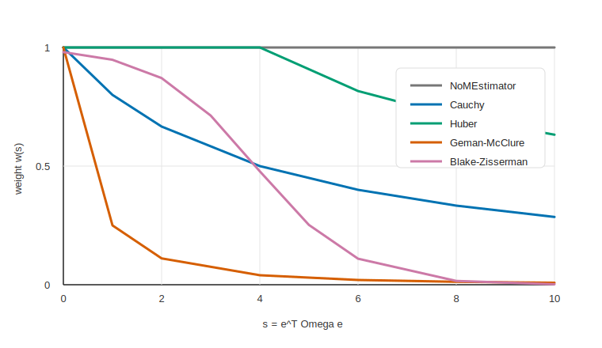

# 第 3 章：最小二乘与 residual 方向

第 2 章把 camera residual 的几何输入讲清楚了：

$$
\mathbf p_w
\longrightarrow
\mathbf p_c
\longrightarrow
\hat{\mathbf y}.
$$

但是优化器真正看到的不是“几何链路”，而是一批 residual。每个 residual 都要回答同一个问题：

> 当前状态如果是 $\theta$，预测量和测量量差多少？如果状态沿一个小扰动 $\delta\theta$ 变化，这个差会怎样一阶变化？

这一章先不推某一个具体 residual 的投影 Jacobian，也不推 IMU 动力学 Jacobian。这里先建立所有 residual 共用的优化语言：

1. residual vector 怎么变成一个标量代价；
2. covariance 和 information matrix 为什么进入代价；
3. residual 方向为什么决定 Jacobian 的正负号；
4. Kalibr 怎样把 residual 和 Jacobian 组装成 Gauss-Newton 线性系统；
5. robust kernel 在这个过程中到底改变了什么。

把这一章读顺以后，后面看 camera、gyro、accelerometer 的具体 Jacobian 时，就不会每次都重新纠结“这个负号来自哪里”。

## 3.1 本章依赖顺序

这一章的概念必须按下面的顺序读。

| 顺序 | 本章位置 | 解决的问题 |
|---|---|---|
| 1 | 3.2 | Kalibr 优化器眼里的 `ErrorTerm`、`DesignVariable` 是什么 |
| 2 | 3.3 | 为什么 residual vector 需要变成一个标量代价 |
| 3 | 3.4 | covariance / information matrix 为什么是统计意义上的权重 |
| 4 | 3.5 | Kalibr 为什么使用 square-root information 加权 |
| 5 | 3.6 | residual 方向如何决定 $\delta\mathbf e$ 的符号 |
| 6 | 3.7 | 状态扰动和 residual linearization 怎么定义 Jacobian |
| 7 | 3.8 | Gauss-Newton 的 Hessian 和 RHS 从哪里来 |
| 8 | 3.9 | robust kernel 如何缩放 residual 和 Jacobian |
| 9 | 3.10-3.11 | 全局目标函数和源码如何对应 |

这里的顺序也对应后续章节的写法：先定义 residual，再定义扰动，再推预测量变化，最后按 residual 方向得到 Jacobian。

## 3.2 优化器看到的是 error term

在第 1 章里，我们把 cam-imu 标定问题说成：

> 调整轨迹、外参、时间偏移、bias 和 IMU 参数，让所有相机观测和 IMU 观测都尽量被同一个状态解释。

这句话从建模角度很自然。但 Kalibr 的底层优化器不直接理解“相机”“陀螺仪”“加速度计”。它看到的是一批 error term。

一个 error term 是一个局部约束。第 $k$ 个 error term 可以写成一个函数：

$$
\mathbf e_k(\theta)
\in
\mathbb R^{d_k}.
$$

这里：

| 符号 | 含义 |
|---|---|
| $\theta$ | 当前所有优化状态的集合 |
| $\mathbf e_k$ | 第 $k$ 个 residual vector |
| $d_k$ | residual 维度，例如 camera residual 常见为 $2$，IMU residual 常见为 $3$ |

Kalibr 里和这句话对应的两个实现概念是：

| 源码概念 | 数学含义 |
|---|---|
| `ErrorTerm` | 一个 residual 因子，能计算 $\mathbf e_k$ 和它对相关变量的 Jacobian |
| `DesignVariable` | 一个可优化变量块，例如一个 spline 控制点、一个外参、一个 bias 控制点、一个 time shift |

完整状态可以想成许多变量块拼起来：

$$
\theta
=
\{\theta_1,\theta_2,\ldots,\theta_M\}.
$$

每个变量块都有自己的最小扰动坐标：

$$
\delta\theta_j
\in
\mathbb R^{m_j}.
$$

把所有变量块的扰动拼起来，就是优化器一次线性求解里的未知量：

$$
\delta\theta
=
\begin{bmatrix}
\delta\theta_1\\
\delta\theta_2\\
\vdots\\
\delta\theta_M
\end{bmatrix}.
$$

一个 error term 通常只连接少数几个变量块。比如一个 camera reprojection error 连接到：

1. 对应时刻附近的 pose spline 控制点；
2. 对应 camera 的外参；
3. 这个 camera 的 time shift；
4. 相机内参，如果它也被设为 design variable。

它不会连接所有变量。正因为每个 residual 只连接局部变量，最终的线性系统才是稀疏的。

## 3.3 residual vector 为什么要变成标量

先看最简单的情况。假设只有一个 residual：

$$
\mathbf e(\theta)
=
\begin{bmatrix}
e_1(\theta)\\
e_2(\theta)\\
\vdots\\
e_d(\theta)
\end{bmatrix}.
$$

优化器不能直接说“让一个向量最小”。它需要一个标量来比较两个状态谁更好。最朴素的选择是平方和：

$$
E(\theta)
=
\|\mathbf e(\theta)\|^2
=
\mathbf e(\theta)^\top\mathbf e(\theta).
$$

如果只有一个二维像素 residual：

$$
\mathbf e_\pi
=
\begin{bmatrix}
e_u\\
e_v
\end{bmatrix},
$$

那么朴素代价是：

$$
E_\pi
=
e_u^2+e_v^2.
$$

这个想法对“同单位、同噪声”的 residual 是合理的。但 cam-imu 标定里 residual 的单位不同：

| residual | 单位 |
|---|---|
| camera reprojection | pixel |
| gyroscope | rad/s |
| accelerometer | m/s$^2$ |
| bias motion prior | bias 单位随传感器类型变化 |
| pose motion prior | 由 pose spline regularization 的定义决定 |

这些量不能直接相加。一个 $1$ pixel 的误差和一个 $1$ m/s$^2$ 的误差不是同一种“严重程度”。所以平方和必须带权重。

## 3.4 covariance 到 information matrix

从统计角度看，测量量不是完全准确的。设第 $k$ 个测量对应的 residual 为：

$$
\mathbf e_k(\theta)
\in
\mathbb R^{d_k}.
$$

如果模型正确，并且状态等于真实值，那么 residual 主要由测量噪声造成。假设这个噪声服从零均值高斯分布：

$$
\mathbf e_k
\sim
\mathcal N(\mathbf 0,\boldsymbol\Sigma_k).
$$

这里：

| 符号 | 含义 |
|---|---|
| $\boldsymbol\Sigma_k\in\mathbb R^{d_k\times d_k}$ | residual covariance |
| $\boldsymbol\Omega_k=\boldsymbol\Sigma_k^{-1}$ | information matrix，也就是 inverse covariance |

高斯概率密度为：

$$
p(\mathbf e_k)
=
\frac{1}{\sqrt{(2\pi)^{d_k}|\boldsymbol\Sigma_k|}}
\exp
\left(
-
\frac{1}{2}
\mathbf e_k^\top
\boldsymbol\Sigma_k^{-1}
\mathbf e_k
\right).
$$

现在把这个概率密度变成优化器要最小化的代价。先把和 $\theta$ 有关的部分看清楚。令：

$$
C_k
\triangleq
\frac{1}{\sqrt{(2\pi)^{d_k}|\boldsymbol\Sigma_k|}}.
$$

那么：

$$
p(\mathbf e_k)
=
C_k
\exp
\left(
-
\frac{1}{2}
\mathbf e_k^\top
\boldsymbol\Sigma_k^{-1}
\mathbf e_k
\right).
$$

最大化 $p(\mathbf e_k)$，等价于最大化它的对数，因为 $\log(\cdot)$ 是单调递增函数：

$$
\log p(\mathbf e_k)
=
\log C_k
-
\frac{1}{2}
\mathbf e_k^\top
\boldsymbol\Sigma_k^{-1}
\mathbf e_k.
$$

优化器习惯写成最小化问题，所以取负号：

$$
-
\log p(\mathbf e_k)
=
-
\log C_k
+
\frac{1}{2}
\mathbf e_k^\top
\boldsymbol\Sigma_k^{-1}
\mathbf e_k.
$$

再把 $C_k$ 展开：

$$
-
\log C_k
=
\frac{1}{2}
d_k\log(2\pi)
+
\frac{1}{2}
\log|\boldsymbol\Sigma_k|.
$$

所以：

$$
-
\log p(\mathbf e_k)
=
\frac{1}{2}
\mathbf e_k^\top
\boldsymbol\Sigma_k^{-1}
\mathbf e_k
+
\frac{1}{2}
\log|\boldsymbol\Sigma_k|
+
\frac{d_k}{2}
\log(2\pi).
$$

在 Kalibr 的普通 residual 里，$\boldsymbol\Sigma_k$ 来自测量噪声设置，在一次问题构建后不作为状态 $\theta$ 的函数。因此：

$$
\frac{1}{2}
\log|\boldsymbol\Sigma_k|
+
\frac{d_k}{2}
\log(2\pi)
$$

对优化变量 $\theta$ 是常数。常数项不会影响最优解，可以去掉。

剩下：

$$
\frac{1}{2}
\mathbf e_k(\theta)^\top
\boldsymbol\Sigma_k^{-1}
\mathbf e_k(\theta).
$$

前面的 $\frac{1}{2}$ 也不改变最优解。很多优化推导保留 $\frac{1}{2}$，因为求导后可以抵消平方项产生的 $2$；Kalibr 的 error term 通常直接返回 squared error，所以本书把单项代价写成：

$$
E_k(\theta)
=
\mathbf e_k(\theta)^\top
\boldsymbol\Omega_k
\mathbf e_k(\theta).
$$

于是定义加权范数：

$$
\|\mathbf e_k\|_{\boldsymbol\Omega_k}^2
\triangleq
\mathbf e_k^\top
\boldsymbol\Omega_k
\mathbf e_k.
$$

如果 residual 各维独立且方差相同：

$$
\boldsymbol\Sigma_k
=
\sigma_k^2\mathbf I,
$$

那么：

$$
\boldsymbol\Omega_k
=
\frac{1}{\sigma_k^2}\mathbf I,
$$

所以：

$$
\|\mathbf e_k\|_{\boldsymbol\Omega_k}^2
=
\frac{1}{\sigma_k^2}
\|\mathbf e_k\|^2.
$$

这说明一件直观的事：方差越小，测量越可信，代价权重越大。优化器会更努力地压低这个 residual。

在 Kalibr 源码里，变量名 `invR` 指的就是这里的 information matrix：

$$
\texttt{invR}
\leftrightarrow
\boldsymbol\Omega
=
\boldsymbol\Sigma^{-1}.
$$

名字里的 `R` 可以理解成 measurement covariance / residual covariance 的历史命名。读代码时要记住：`invR` 不是 covariance，而是 inverse covariance。

### 3.4.1 这些 covariance 从哪里来

到这里容易产生一个实际问题：

> $\boldsymbol\Sigma_k$ 和 $\boldsymbol\Omega_k$ 是优化前给定的，还是 Kalibr 从这次数据里估出来的？

在 Kalibr 的 cam-imu 主优化里，普通 measurement residual 的 covariance 通常是**优化前给定的噪声模型**，不是作为状态量从这次标定数据里一起估计出来的。优化过程中会变化的是 robust weight $w_k$，不是基础 information matrix $\boldsymbol\Omega_k$。

可以把权重分成两层：

| 层次 | 符号 | 是否随迭代变化 | 来源 |
|---|---|---|---|
| measurement information | $\boldsymbol\Omega_k=\boldsymbol\Sigma_k^{-1}$ | 通常固定 | 用户参数、IMU YAML、噪声标定结果、经验设置 |
| robust weight | $w_k=w(s_k)$ | 会随 residual 变化 | 当前迭代算出的 Mahalanobis error |

相机角点 residual 的 covariance 来自 `reprojection_sigma`。当前仓库中，cam-imu 代码把每个角点的 covariance 设成：

$$
\boldsymbol\Sigma_\pi
=
2\sigma_\pi^2\mathbf I_2,
$$

然后：

$$
\boldsymbol\Omega_\pi
=
\boldsymbol\Sigma_\pi^{-1}.
$$

这里的 $\sigma_\pi$ 对应代码里的 `cornerUncertainty`，由命令行或参数里的 `reprojection_sigma` 传入。也就是说，主优化并不会为每个角点单独估计一个 covariance。角点检测质量主要通过前端筛选、外点过滤和 robust kernel 处理；进入 residual 后，每个角点默认使用同一个像素噪声尺度。

陀螺仪和加速度计 residual 的 covariance 来自 IMU 配置里的 noise density 和 update rate。设 IMU 采样率为：

$$
f=\texttt{update\_rate},
\qquad
\Delta t=\frac{1}{f}.
$$

如果 gyro noise density 是 $\sigma_{\omega,c}$，Kalibr 转成离散单次测量标准差：

$$
\sigma_{\omega,d}
=
\frac{\sigma_{\omega,c}}{\sqrt{\Delta t}}
=
\sigma_{\omega,c}\sqrt{f}.
$$

对应 covariance 和 information matrix 是：

$$
\boldsymbol\Sigma_\omega
=
\sigma_{\omega,d}^2\mathbf I_3,
\qquad
\boldsymbol\Omega_\omega
=
\boldsymbol\Sigma_\omega^{-1}.
$$

accelerometer 同理。如果 accelerometer noise density 是 $\sigma_{a,c}$：

$$
\sigma_{a,d}
=
\sigma_{a,c}\sqrt{f},
$$

于是：

$$
\boldsymbol\Sigma_a
=
\sigma_{a,d}^2\mathbf I_3,
\qquad
\boldsymbol\Omega_a
=
\boldsymbol\Sigma_a^{-1}.
$$

IMU bias motion prior 使用的是 IMU 配置里的 random walk 参数。代码里会构造：

$$
\mathbf W_g
=
\frac{1}{\sigma_{b_g}^2}\mathbf I_3,
\qquad
\mathbf W_a
=
\frac{1}{\sigma_{b_a}^2}\mathbf I_3.
$$

这些也是优化前给定的先验权重，不是从当前 residual 自动估出来的。

因此，Kalibr 里“数据计算出来”的主要不是基础 covariance，而是：

1. 当前状态下的 residual $\mathbf e_k(\theta)$。
2. 由 residual 得到的 Mahalanobis squared error $s_k=\mathbf e_k^\top\boldsymbol\Omega_k\mathbf e_k$。
3. robust policy 根据 $s_k$ 返回的权重 $w_k$。

基础 covariance 如果设错，会改变不同 residual group 的相对话语权。比如相机 $\sigma_\pi$ 设得太小，camera residual 会被过度信任；gyro noise density 设得太小，轨迹会更努力贴合 gyro 读数。Kalibr 报告里可以统计优化后的 residual 分布，但这些统计主要用于诊断，不会反过来自动重估本轮优化里的 $\boldsymbol\Sigma_k$。

## 3.5 square-root information

直接使用：

$$
\mathbf e^\top\boldsymbol\Omega\mathbf e
$$

当然可以。但优化器构造线性系统时，更常用 square-root 形式。

先看一维 residual。假设：

$$
e\sim\mathcal N(0,\sigma^2).
$$

它的加权代价是：

$$
\frac{e^2}{\sigma^2}.
$$

这可以写成：

$$
\left(\frac{e}{\sigma}\right)^2.
$$

也就是说，我们没有直接最小化原始 residual $e$，而是先把它除以标准差 $\sigma$，再做普通平方和。定义：

$$
\bar e
\triangleq
\frac{e}{\sigma}.
$$

那么：

$$
\frac{e^2}{\sigma^2}
=
\bar e^2.
$$

这个 $\bar e$ 的单位已经被消掉了。原始 residual 可能是 pixel、rad/s 或 m/s$^2$，但除以它自己的标准差后，$\bar e$ 表示“偏离了几个标准差”。这就是 normalized residual。

多维情况下也想做同一件事：

> 找一个矩阵，把 raw residual $\mathbf e$ 变成一个单位 covariance 的 normalized residual。

这个 normalized residual 在优化里通常叫 whitened residual。名字里的 white 来自白噪声：各维方差为 $1$，且互不相关。

令：

$$
\boldsymbol\Omega
=
\mathbf L\mathbf L^\top.
$$

这里 $\mathbf L$ 是 information matrix 的一个矩阵平方根。Kalibr 的 `ErrorTermFs::invR()` 返回的是：

$$
\boldsymbol\Omega
=
\texttt{\_sqrtInvR}\,
\texttt{\_sqrtInvR}^{\top}.
$$

所以本章记：

$$
\mathbf L
\leftrightarrow
\texttt{\_sqrtInvR}.
$$

定义 whitened residual：

$$
\bar{\mathbf e}
\triangleq
\mathbf L^\top\mathbf e.
$$

这个定义正是多维版的“除以标准差”。如果 $\mathbf e$ 的 covariance 是：

$$
\mathrm{Cov}(\mathbf e)
=
\boldsymbol\Sigma,
\qquad
\boldsymbol\Omega
=
\boldsymbol\Sigma^{-1}
=
\mathbf L\mathbf L^\top,
$$

那么：

$$
\mathrm{Cov}(\bar{\mathbf e})
=
\mathrm{Cov}(\mathbf L^\top\mathbf e)
=
\mathbf L^\top
\boldsymbol\Sigma
\mathbf L.
$$

这一步可以从 covariance 的定义直接推出。先设：

$$
\boldsymbol\mu_e
\triangleq
\mathbb E[\mathbf e].
$$

covariance 定义为：

$$
\mathrm{Cov}(\mathbf e)
\triangleq
\mathbb E
\left[
(\mathbf e-\boldsymbol\mu_e)
(\mathbf e-\boldsymbol\mu_e)^\top
\right].
$$

现在考虑一个常矩阵 $\mathbf A$ 作用到随机向量 $\mathbf e$ 上：

$$
\mathbf y
=
\mathbf A\mathbf e.
$$

它的均值是：

$$
\boldsymbol\mu_y
\triangleq
\mathbb E[\mathbf y]
=
\mathbb E[\mathbf A\mathbf e]
=
\mathbf A\mathbb E[\mathbf e]
=
\mathbf A\boldsymbol\mu_e.
$$

所以：

$$
\mathbf y-\boldsymbol\mu_y
=
\mathbf A\mathbf e-\mathbf A\boldsymbol\mu_e
=
\mathbf A(\mathbf e-\boldsymbol\mu_e).
$$

把它代回 covariance 定义：

$$
\begin{aligned}
\mathrm{Cov}(\mathbf y)
&=
\mathbb E
\left[
(\mathbf y-\boldsymbol\mu_y)
(\mathbf y-\boldsymbol\mu_y)^\top
\right] \\
&=
\mathbb E
\left[
\mathbf A(\mathbf e-\boldsymbol\mu_e)
(\mathbf e-\boldsymbol\mu_e)^\top
\mathbf A^\top
\right].
\end{aligned}
$$

因为 $\mathbf A$ 是固定矩阵，不是随机变量，可以从期望里提出来：

$$
\mathrm{Cov}(\mathbf y)
=
\mathbf A
\mathbb E
\left[
(\mathbf e-\boldsymbol\mu_e)
(\mathbf e-\boldsymbol\mu_e)^\top
\right]
\mathbf A^\top.
$$

因此得到通用结论：

$$
\mathrm{Cov}(\mathbf A\mathbf e)
=
\mathbf A\,\mathrm{Cov}(\mathbf e)\,\mathbf A^\top.
$$

现在令：

$$
\mathbf A=\mathbf L^\top,
\qquad
\bar{\mathbf e}
=
\mathbf L^\top\mathbf e
=
\mathbf A\mathbf e.
$$

于是：

$$
\mathrm{Cov}(\bar{\mathbf e})
=
\mathbf L^\top
\mathrm{Cov}(\mathbf e)
(\mathbf L^\top)^\top
=
\mathbf L^\top
\boldsymbol\Sigma
\mathbf L.
$$

因为：

$$
\boldsymbol\Sigma
=
(\mathbf L\mathbf L^\top)^{-1}
=
\mathbf L^{-\top}\mathbf L^{-1},
$$

所以：

$$
\mathrm{Cov}(\bar{\mathbf e})
=
\mathbf L^\top
\mathbf L^{-\top}
\mathbf L^{-1}
\mathbf L
=
\mathbf I.
$$

这就是 whitened 的含义：raw residual 经过 $\mathbf L^\top$ 之后，变成了 covariance 为 $\mathbf I$ 的 residual。对角 covariance 时，它就是逐维除以标准差；非对角 covariance 时，它还会把相关的误差方向解耦。

那么：

$$
\|\bar{\mathbf e}\|^2
=
(\mathbf L^\top\mathbf e)^\top
(\mathbf L^\top\mathbf e)
=
\mathbf e^\top
\mathbf L\mathbf L^\top
\mathbf e
=
\mathbf e^\top
\boldsymbol\Omega
\mathbf e.
$$

也就是说，带 information matrix 的加权最小二乘，可以等价地写成普通最小二乘：

$$
\|\mathbf e\|_{\boldsymbol\Omega}^2
=
\|\mathbf L^\top\mathbf e\|^2.
$$

这一步很重要，因为它把一个加权问题：

$$
\min_\theta
\mathbf e(\theta)^\top
\boldsymbol\Omega
\mathbf e(\theta)
$$

改写成了普通最小二乘问题：

$$
\min_\theta
\|\bar{\mathbf e}(\theta)\|^2.
$$

普通 Gauss-Newton 线性系统天然就是从：

$$
\|\bar{\mathbf e}+\bar{\mathbf J}\delta\theta\|^2
$$

推出：

$$
\bar{\mathbf J}^\top
\bar{\mathbf J}\delta\theta
=
-
\bar{\mathbf J}^\top
\bar{\mathbf e}.
$$

所以 Kalibr 不需要在每一步都显式写：

$$
\mathbf J^\top\boldsymbol\Omega\mathbf J,
\qquad
\mathbf J^\top\boldsymbol\Omega\mathbf e.
$$

它可以先把 residual 和 Jacobian 都 whiten，然后按普通 least-squares 的方式组装。两种写法完全等价。

如果：

$$
\mathbf J
=
\frac{\partial \mathbf e}{\partial\delta\theta},
$$

那么 whitened Jacobian 是：

$$
\bar{\mathbf J}
=
\frac{\partial \bar{\mathbf e}}{\partial\delta\theta}
=
\frac{\partial(\mathbf L^\top\mathbf e)}{\partial\delta\theta}
=
\mathbf L^\top\mathbf J.
$$

这里的 $\bar{\mathbf J}$ 就叫 whitened Jacobian。它不是一个新的物理模型，而是 raw Jacobian 经过同一个 square-root information 矩阵缩放后的结果。

为什么 residual 和 Jacobian 必须乘同一个 $\mathbf L^\top$？因为线性化的是 whitened residual 本身：

$$
\bar{\mathbf e}(\theta\boxplus_K\delta\theta)
=
\mathbf L^\top
\mathbf e(\theta\boxplus_K\delta\theta)
\approx
\mathbf L^\top
\left(
\mathbf e(\theta)
+
\mathbf J\delta\theta
\right).
$$

展开：

$$
\bar{\mathbf e}(\theta\boxplus_K\delta\theta)
\approx
\underbrace{\mathbf L^\top\mathbf e(\theta)}_{\bar{\mathbf e}}
+
\underbrace{\mathbf L^\top\mathbf J}_{\bar{\mathbf J}}
\delta\theta.
$$

因此，只要 residual 被 whiten，Jacobian 也必须被同一个矩阵 whiten。否则线性化就不再对应同一个函数。

这里 $\mathbf L$ 在一次 residual 计算中视为固定，因为它来自测量噪声模型，而不是当前状态的预测函数。

## 3.6 residual 方向决定 $\delta\mathbf e$ 的符号

现在开始处理最容易混淆的负号。

设测量量为 $\mathbf z$，预测量为：

$$
\hat{\mathbf z}
=
h(\theta).
$$

residual 有两种常见写法。

第一种是预测减测量：

$$
\mathbf e
=
\hat{\mathbf z}-\mathbf z.
$$

第二种是测量减预测：

$$
\mathbf e
=
\mathbf z-\hat{\mathbf z}.
$$

这两种写法的平方代价一样，因为：

$$
(\hat{\mathbf z}-\mathbf z)^\top
\boldsymbol\Omega
(\hat{\mathbf z}-\mathbf z)
=
(\mathbf z-\hat{\mathbf z})^\top
\boldsymbol\Omega
(\mathbf z-\hat{\mathbf z}).
$$

但是它们的 Jacobian 符号不同。

状态扰动后，预测量发生一阶变化：

$$
\hat{\mathbf z}^+
=
\hat{\mathbf z}
+
\delta\hat{\mathbf z}.
$$

测量量 $\mathbf z$ 是已经记录下来的传感器数据，线性化时固定不变：

$$
\delta\mathbf z=\mathbf 0.
$$

如果 residual 是预测减测量：

$$
\mathbf e
=
\hat{\mathbf z}-\mathbf z,
$$

那么扰动后的 residual 是：

$$
\mathbf e^+
=
\hat{\mathbf z}^+-\mathbf z.
$$

因此：

$$
\delta\mathbf e
\triangleq
\mathbf e^+-\mathbf e
=
(\hat{\mathbf z}^+-\mathbf z)
-
(\hat{\mathbf z}-\mathbf z)
=
\delta\hat{\mathbf z}.
$$

如果 residual 是测量减预测：

$$
\mathbf e
=
\mathbf z-\hat{\mathbf z},
$$

那么：

$$
\mathbf e^+
=
\mathbf z-\hat{\mathbf z}^+,
$$

于是：

$$
\delta\mathbf e
=
(\mathbf z-\hat{\mathbf z}^+)
-
(\mathbf z-\hat{\mathbf z})
=
-\delta\hat{\mathbf z}.
$$

所以：

$$
\boxed{
\mathbf e=\hat{\mathbf z}-\mathbf z
\quad\Longrightarrow\quad
\mathbf J_{\mathbf e}
=
\mathbf J_{\hat{\mathbf z}}
}
$$

$$
\boxed{
\mathbf e=\mathbf z-\hat{\mathbf z}
\quad\Longrightarrow\quad
\mathbf J_{\mathbf e}
=
-\mathbf J_{\hat{\mathbf z}}
}
$$

这个负号只来自 residual 的相减方向。它不是 Lie group left/right 扰动带来的负号。

Kalibr 的核心 residual 方向如下。

| residual | 预测量 | 测量量 | residual 方向 | Jacobian 符号 |
|---|---|---|---|---|
| camera reprojection | $\hat{\mathbf y}$ | $\mathbf y$ | $\mathbf e_\pi=\mathbf y-\hat{\mathbf y}$ | $\mathbf J_{\mathbf e_\pi}=-\mathbf J_{\hat{\mathbf y}}$ |
| gyroscope | $\hat{\boldsymbol\omega}$ | $\mathbf z_\omega$ | $\mathbf e_\omega=\hat{\boldsymbol\omega}-\mathbf z_\omega$ | $\mathbf J_{\mathbf e_\omega}=+\mathbf J_{\hat{\boldsymbol\omega}}$ |
| accelerometer | $\hat{\mathbf a}$ | $\mathbf z_a$ | $\mathbf e_a=\hat{\mathbf a}-\mathbf z_a$ | $\mathbf J_{\mathbf e_a}=+\mathbf J_{\hat{\mathbf a}}$ |

一个一维例子能说明为什么两种 residual 方向都可以，但 Jacobian 必须配套。

设预测量就是状态本身：

$$
\hat z=x,
\qquad
z=10.
$$

当前 $x=8$。如果用预测减测量：

$$
e=x-z=-2,
\qquad
J_e=1.
$$

普通最小二乘的一维 Gauss-Newton 右端是：

$$
b=-J_e e=2.
$$

所以更新方向是 $\delta x=2$，把 $x$ 推向 $10$。

如果用测量减预测：

$$
e=z-x=2,
\qquad
J_e=-1.
$$

右端仍然是：

$$
b=-J_e e
=
-(-1)\cdot 2
=
2.
$$

只要 residual 和 Jacobian 的符号一致，更新方向不变。真正危险的是只改 residual 方向，却忘了同步改 Jacobian 符号。

## 3.7 状态扰动和 residual linearization

第 0 章已经规定，本书在对齐 Kalibr 源码时使用 Kalibr 的扰动记号：

$$
\theta^+
=
\theta\boxplus_K\delta\theta.
$$

这里 $\delta\theta$ 是所有 design variable 的最小扰动坐标拼起来的向量。对于某个 residual：

$$
\mathbf e_k(\theta)
\in
\mathbb R^{d_k},
$$

我们关心扰动后的 residual：

$$
\mathbf e_k(\theta\boxplus_K\delta\theta).
$$

在当前状态附近做一阶展开：

$$
\mathbf e_k(\theta\boxplus_K\delta\theta)
\approx
\mathbf e_k(\theta)
+
\mathbf J_k\delta\theta.
$$

这里的 Jacobian 定义为：

$$
\mathbf J_k
\triangleq
\left.
\frac{\partial
\mathbf e_k(\theta\boxplus_K\delta\theta)}
{\partial\delta\theta}
\right|_{\delta\theta=\mathbf 0}.
$$

如果只看第 $j$ 个变量块：

$$
\mathbf J_{k,j}
\triangleq
\left.
\frac{\partial
\mathbf e_k(
\theta_1,\ldots,
\theta_j\boxplus_K\delta\theta_j,
\ldots,\theta_M)}
{\partial\delta\theta_j}
\right|_{\delta\theta_j=\mathbf 0}.
$$

维度是：

$$
\mathbf J_{k,j}
\in
\mathbb R^{d_k\times m_j}.
$$

如果第 $k$ 个 residual 不依赖第 $j$ 个变量块，则：

$$
\mathbf J_{k,j}
=
\mathbf 0.
$$

把所有变量块的 Jacobian 横向拼起来：

$$
\mathbf J_k
=
\begin{bmatrix}
\mathbf J_{k,1}
&
\mathbf J_{k,2}
&
\cdots
&
\mathbf J_{k,M}
\end{bmatrix}.
$$

大部分块都是零，所以 Kalibr 不会真的构造一个巨大的 dense matrix。它用 `JacobianContainer` 按 design variable 存储非零块。

对应到 square-root weighting，whitened residual 的线性化是：

$$
\bar{\mathbf e}_k(\theta\boxplus_K\delta\theta)
\approx
\bar{\mathbf e}_k
+
\bar{\mathbf J}_k\delta\theta,
$$

其中：

$$
\bar{\mathbf e}_k
=
\mathbf L_k^\top\mathbf e_k,
\qquad
\bar{\mathbf J}_k
=
\mathbf L_k^\top\mathbf J_k.
$$

## 3.8 Gauss-Newton 正规方程

先忽略 robust kernel。所有 residual 的加权最小二乘问题可以写成：

$$
\min_{\theta}
\sum_k
\|\mathbf e_k(\theta)\|_{\boldsymbol\Omega_k}^2.
$$

在当前状态 $\theta$ 附近，改成求一个小扰动：

$$
\min_{\delta\theta}
\sum_k
\left\|
\bar{\mathbf e}_k
+
\bar{\mathbf J}_k\delta\theta
\right\|^2.
$$

令：

$$
F(\delta\theta)
=
\sum_k
\left(
\bar{\mathbf e}_k+\bar{\mathbf J}_k\delta\theta
\right)^\top
\left(
\bar{\mathbf e}_k+\bar{\mathbf J}_k\delta\theta
\right).
$$

对 $\delta\theta$ 求导：

$$
\frac{\partial F}{\partial\delta\theta}
=
2\sum_k
\bar{\mathbf J}_k^\top
\left(
\bar{\mathbf e}_k+\bar{\mathbf J}_k\delta\theta
\right).
$$

令导数为零：

$$
\sum_k
\bar{\mathbf J}_k^\top
\bar{\mathbf J}_k
\delta\theta
=
-
\sum_k
\bar{\mathbf J}_k^\top
\bar{\mathbf e}_k.
$$

定义 Gauss-Newton normal matrix 和右端：

$$
\mathbf H
\triangleq
\sum_k
\bar{\mathbf J}_k^\top
\bar{\mathbf J}_k,
\qquad
\mathbf b
\triangleq
-
\sum_k
\bar{\mathbf J}_k^\top
\bar{\mathbf e}_k.
$$

于是得到线性系统：

$$
\boxed{
\mathbf H\delta\theta=\mathbf b
}
$$

把 $\bar{\mathbf e}_k=\mathbf L_k^\top\mathbf e_k$ 和 $\bar{\mathbf J}_k=\mathbf L_k^\top\mathbf J_k$ 代回去：

$$
\mathbf H
=
\sum_k
\mathbf J_k^\top
\mathbf L_k\mathbf L_k^\top
\mathbf J_k
=
\sum_k
\mathbf J_k^\top
\boldsymbol\Omega_k
\mathbf J_k,
$$

$$
\mathbf b
=
-
\sum_k
\mathbf J_k^\top
\mathbf L_k\mathbf L_k^\top
\mathbf e_k
=
-
\sum_k
\mathbf J_k^\top
\boldsymbol\Omega_k
\mathbf e_k.
$$

这就是 Kalibr `JacobianContainer::evaluateHessian()` 组装的数学内容。

严格说，$\mathbf H$ 是 Gauss-Newton normal matrix，不是完整二阶 Hessian。完整 Hessian 还包含 residual 二阶导数项。Gauss-Newton 忽略这些二阶项，用：

$$
\mathbf H_{\mathrm{GN}}
=
\sum_k\mathbf J_k^\top\boldsymbol\Omega_k\mathbf J_k
$$

作为近似。Kalibr 源码里仍然把它叫 Hessian block，这是优化库里常见的命名。

现在把这个式子按变量块展开。这里有两类下标，先分清楚：

| 下标 | 含义 |
|---|---|
| $k$ | residual / error term 的编号 |
| $i,j$ | design variable block 的编号 |

第 $k$ 个 residual 的完整 Jacobian 是对所有变量块的 Jacobian 横向拼接：

$$
\mathbf J_k
=
\begin{bmatrix}
\mathbf J_{k,1}
&
\mathbf J_{k,2}
&
\cdots
&
\mathbf J_{k,M}
\end{bmatrix}.
$$

其中：

$$
\mathbf J_{k,i}
\triangleq
\frac{\partial\mathbf e_k}{\partial\delta\theta_i}.
$$

所以 $\mathbf J_{k,i}$ 的读法是：

> 第 $k$ 个 residual，对第 $i$ 个变量块的 Jacobian。

它不是“第 $k,i$ 个 residual”。$k$ 和 $i$ 分别来自两套索引：一个索引 residual，一个索引变量块。

如果第 $k$ 个 residual 不依赖第 $i$ 个变量块，那么：

$$
\mathbf J_{k,i}
=
\mathbf 0.
$$

为了看清楚块结构，先只假设第 $k$ 个 residual 连接两个变量块 $i$ 和 $j$。那么：

$$
\delta\theta_{ij}
=
\begin{bmatrix}
\delta\theta_i\\
\delta\theta_j
\end{bmatrix},
\qquad
\mathbf J_k
=
\begin{bmatrix}
\mathbf J_{k,i} & \mathbf J_{k,j}
\end{bmatrix}.
$$

这个 residual 对 Hessian 的贡献是：

$$
\mathbf J_k^\top
\boldsymbol\Omega_k
\mathbf J_k.
$$

把块矩阵代进去：

$$
\begin{aligned}
\mathbf J_k^\top
\boldsymbol\Omega_k
\mathbf J_k
&=
\begin{bmatrix}
\mathbf J_{k,i}^\top\\
\mathbf J_{k,j}^\top
\end{bmatrix}
\boldsymbol\Omega_k
\begin{bmatrix}
\mathbf J_{k,i} & \mathbf J_{k,j}
\end{bmatrix} \\
&=
\begin{bmatrix}
\mathbf J_{k,i}^\top\boldsymbol\Omega_k\mathbf J_{k,i}
&
\mathbf J_{k,i}^\top\boldsymbol\Omega_k\mathbf J_{k,j}\\
\mathbf J_{k,j}^\top\boldsymbol\Omega_k\mathbf J_{k,i}
&
\mathbf J_{k,j}^\top\boldsymbol\Omega_k\mathbf J_{k,j}
\end{bmatrix}.
\end{aligned}
$$

因此，第 $k$ 个 residual 给全局 Hessian 的 $(i,j)$ block 的贡献是：

$$
\mathbf H_{ij}
\mathrel{+}=
\mathbf J_{k,i}^\top
\boldsymbol\Omega_k
\mathbf J_{k,j}.
$$

如果另一个 residual $k'$ 也同时依赖变量块 $i$ 和 $j$，它也会给同一个 $\mathbf H_{ij}$ 加一项。所以完整的 block 是对所有相关 residual 累加：

$$
\mathbf H_{ij}
=
\sum_{k\in\mathcal K_{ij}}
\mathbf J_{k,i}^\top
\boldsymbol\Omega_k
\mathbf J_{k,j}.
$$

这里 $\mathcal K_{ij}$ 表示所有同时连接变量块 $i$ 和 $j$ 的 residual 集合。源码里不是先显式写出这个集合，而是遍历每个 error term，把它连接到的变量块两两组合并累加到对应 Hessian block。

从复杂度角度看，这里不是对全局 $M$ 个变量块做 $O(M^2)$ 遍历。第 $k$ 个 residual 只连接它实际依赖的少数变量块。若它连接的变量块数量记为 $q_k$，那么这个 residual 需要贡献的 Hessian block 数量大约是：

$$
\frac{q_k(q_k+1)}{2},
$$

因为 Hessian 对称，只需要组装上三角 block。总装配复杂度更接近：

$$
\sum_k O(q_k^2),
$$

而不是 $O(M^2)$。在 camera / IMU 标定里，单个 residual 通常只依赖局部 spline 控制点、一个 sensor 外参、一个 bias 或 time shift，所以 $q_k$ 相对全局变量数很小。实际工程优化一般集中在预分配稀疏结构、避免重复查找/拷贝、批量处理同结构 residual，或使用 Schur complement / matrix-free 方法；不能简单把 $q_k^2$ 改成 $q_k$，因为 $\mathbf H_{ij}$ 这些交叉 block 本身就是变量耦合信息。

RHS 只有一个变量块下标，因为它是向量。第 $k$ 个 residual 给第 $i$ 个 RHS block 的贡献是：

$$
\mathbf b_i
\mathrel{+}=
-
\mathbf J_{k,i}^\top
\boldsymbol\Omega_k
\mathbf e_k.
$$

这两个式子是后面读源码时最重要的锚点。

## 3.9 robust kernel 改变的是权重

真实数据里会有外点。例如：

1. 角点检测错了；
2. 某帧图像模糊；
3. IMU 某段有冲击或同步问题；
4. 初始轨迹还比较差，导致某些 residual 暂时很大。

如果所有 residual 都按普通二次代价处理，大 residual 的影响会随平方增长，可能把优化拖偏。比如一个误检测的角点，如果 reprojection error 很大，它会在 RHS 里产生很大的：

$$
-\mathbf J^\top\boldsymbol\Omega\mathbf e,
$$

从而强行拉动状态去解释一个本来就不可靠的观测。

所以 robust kernel 要解决的问题是：

> 不改变 residual 的几何定义，但让“明显过大”的 residual 在当前线性系统里少说话。

这里需要先回答一个问题：优化器怎么判断一个 residual “明显过大”？

不能直接看 raw residual vector $\mathbf e_k$，因为不同 residual 的单位和维度不同。camera residual 是 pixel，gyro residual 是 rad/s，accelerometer residual 是 m/s$^2$。也不能只看普通欧氏范数 $\|\mathbf e_k\|^2$，因为它没有考虑这个 residual 本来应该有多大噪声。

第 3.4 节已经说明，最自然的 normalized 大小是 Mahalanobis squared error：

$$
s_k
\triangleq
\|\mathbf e_k\|_{\boldsymbol\Omega_k}^2
=
\mathbf e_k^\top
\boldsymbol\Omega_k
\mathbf e_k.
$$

等价地，用 whitened residual 写就是：

$$
s_k
=
\|\bar{\mathbf e}_k\|^2.
$$

所以 $s_k$ 是一个无量纲标量。它的直觉是：

> 第 $k$ 个 residual 在自己的噪声尺度下到底有多大。

这就是为什么 robust kernel 不直接接收 $\mathbf e_k$，而是接收 $s_k$。一个 $5$ pixel 的 reprojection error 是否离谱，要看像素噪声标准差是多少；一个 $0.05$ rad/s 的 gyro error 是否离谱，也要看 gyro noise 设置是多少。Mahalanobis squared error 把这些不同单位的 residual 放到同一个“按噪声归一化后的大小”上比较。

这里说 raw squared Mahalanobis error，raw 的意思是：

> 已经使用 covariance / information matrix 加权，但还没有经过 robust kernel 降权。

也就是说，raw 不是指“完全没加权的像素误差”或“完全没加权的 IMU 误差”。它指的是 robust 之前的 squared error：

$$
s_k
=
\mathbf e_k^\top
\boldsymbol\Omega_k
\mathbf e_k.
$$

普通高斯最小二乘默认这个 residual 的代价就是 $s_k$。robust kernel 的想法是：小 residual 仍然近似按 $s_k$ 处理；大 residual 不再让代价按二次速度无限增长。

在很多鲁棒最小二乘教材里，会把代价写成：

$$
\rho(s_k),
$$

其中 $\rho(\cdot)$ 是一个增长速度比线性更慢的 robust loss。Kalibr 的实现接口没有要求每个 policy 显式返回 $\rho(s)$，而是让 `MEstimator` policy 接收当前的 $s_k$，返回一个权重：

$$
w_k
=
w(s_k).
$$

所以 `MEstimator` policy 可以理解成一个可插拔规则：

> 给定当前 residual 的 normalized squared size $s_k$，决定它在本轮线性系统里应该保留多少权重。

如果没有 robust kernel：

$$
w_k=1.
$$

如果 $s_k$ 很大，Cauchy、Huber、Blake-Zisserman 等 policy 会给出小于 $1$ 的权重，让这个 residual 的影响下降。

这里要特别注意：Kalibr 不是把 Cauchy、Huber、Blake-Zisserman 的结果“综合”起来。每个 error term 当前只挂一个 `MEstimator` policy。这个 policy 可以是：

$$
\text{NoMEstimator},\quad
\text{Cauchy},\quad
\text{Huber},\quad
\text{Geman-McClure},\quad
\text{Blake-Zisserman}
$$

中的一个。优化器调用这个 policy 的：

$$
w(s_k)
$$

得到当前 residual 的一个标量权重 $w_k$。

这个权重很重要，但它不是“单独决定当前步骤更新多少”的唯一因素。一次 Gauss-Newton / LM 更新由整个线性系统共同决定：

$$
\left(
\sum_k
w_k
\mathbf J_k^\top
\boldsymbol\Omega_k
\mathbf J_k
\right)
\delta\theta
=
-
\sum_k
w_k
\mathbf J_k^\top
\boldsymbol\Omega_k
\mathbf e_k.
$$

所以 $w_k$ 的作用是改变第 $k$ 个 residual 对全局 $\mathbf H$ 和 $\mathbf b$ 的贡献。最终的 $\delta\theta$ 还取决于所有 residual、所有 Jacobian、所有 information matrix，以及 LM damping / trust region 等优化器设置。

这里的 LM damping 可以先理解成 Levenberg-Marquardt 里的当前阻尼强度，常用符号就是：

$$
\lambda.
$$

如果不写实现细节，Gauss-Newton 的线性系统是：

$$
\mathbf H\delta\theta
=
\mathbf b.
$$

LM 会在这个系统上增加一个阻尼项，让一步更新更保守。最常见的抽象写法是：

$$
\left(
\mathbf H+\lambda\mathbf I
\right)
\delta\theta
=
\mathbf b,
$$

或者更一般地写成：

$$
\left(
\mathbf H+\lambda\mathbf D
\right)
\delta\theta
=
\mathbf b,
$$

其中 $\mathbf D$ 是某种对角尺度矩阵。$\lambda$ 越大，这一步越像小步梯度下降；$\lambda$ 越小，这一步越接近 Gauss-Newton。

所以 LM damping 和 robust weight 的层级不同：

| 量 | 作用对象 | 是否每个 residual 各自一个 | 直觉 |
|---|---|---|---|
| $w_k$ | 第 $k$ 个 residual 对 $\mathbf H,\mathbf b$ 的贡献 | 是 | 这个观测本轮是否可信 |
| $\lambda$ | 整个线性系统的阻尼 | 否 | 这一步整体走多大胆 |

本章读到这里，只需要掌握到这个层次：

> $\lambda$ 是整步优化的阻尼，不是 residual 权重；它影响的是整个线性系统的求解步长。

Kalibr 的优化器默认使用 Levenberg-Marquardt trust-region policy。源码里当前的 damping 变量也叫 `_lambda`。它会根据上一步实际下降和线性模型预测下降的一致程度来调节：如果一步更新效果好，就减小 damping；如果一步更新效果差，就增大 damping。

下面这个实现细节现在可以先跳过；它只用于之后读优化器后端源码时对号入座。Kalibr 不是把 `_lambda` 直接写成源码里的：

$$
\mathbf H+\lambda\mathbf I.
$$

它会把 `_lambda` 传给 linear solver 的 constant conditioner。conditioner 可以理解成“交给线性求解器的一组对角阻尼尺度”。具体 solver 再把这个 conditioner 转成实际加到系统里的对角增量。例如 block Cholesky solver 会把 conditioner 自乘后加到对角上。也就是说，`constant conditioner` 是 Kalibr 后端的数值实现接口，不是一个新的 residual，也不是一个新的 Jacobian。

因此不要把上面的教学公式逐行理解成源码里一定直接出现 $\mathbf H+\lambda\mathbf I$。读源码时要把两层含义分开：

1. 数学上，$\lambda$ 是 LM / trust-region 的阻尼强度。
2. 实现上，它通过 linear solver 的 conditioner 进入 Hessian 对角。
3. 它不是某个 residual 的 M-estimator weight，也不由 Cauchy / Huber / Blake-Zisserman 计算。

Kalibr 源码里的几个 weight policy 直接给出 $w(s)$。设：

$$
s
=
\mathbf e^\top\boldsymbol\Omega\mathbf e.
$$

NoMEstimator 不降权：

$$
w_{\mathrm{none}}(s)
=
1.
$$

Cauchy policy 的参数在源码里叫 `_sigma2`，这里记为 $c^2$：

$$
w_{\mathrm{Cauchy}}(s)
=
\frac{1}{1+s/c^2}.
$$

当 $s\ll c^2$ 时，$w\approx 1$；当 $s\gg c^2$ 时，$w\approx c^2/s$，大 residual 会被明显降权。

Huber policy 的参数是阈值 $k$：

$$
w_{\mathrm{Huber}}(s)
=
\begin{cases}
1, & s<k^2,\\
\dfrac{k}{\sqrt{s}}, & s\ge k^2.
\end{cases}
$$

也就是说，小 residual 不动，大 residual 按 $1/\sqrt{s}$ 降权。

Geman-McClure policy 的参数也在源码里叫 `_sigma2`，这里记为 $c^2$：

$$
w_{\mathrm{GM}}(s)
=
\frac{c^2}{(c^2+s)^2}.
$$

Blake-Zisserman policy 使用：

$$
w_{\mathrm{BZ}}(s)
=
\frac{\exp(-s)}
{\exp(-s)+\epsilon}.
$$

其中 $\epsilon$ 不是直接手写固定值，而是由 error dimension、cut probability 和 cut weight 算出来：

$$
\epsilon
=
\frac{1-w_{\mathrm{cut}}}{w_{\mathrm{cut}}}
\exp\left(
-\chi^2_{\mathrm{df}}{}^{-1}(p_{\mathrm{cut}})
\right).
$$

这里 $\chi^2_{\mathrm{df}}{}^{-1}(p_{\mathrm{cut}})$ 是自由度为 $\mathrm{df}$ 的卡方分布在概率 $p_{\mathrm{cut}}$ 处的 inverse CDF。源码默认含义是：希望某个概率以内的 residual 基本保留，尾部 residual 平滑降权。

下面的图只画趋势。为了让曲线能放在同一张图上，图中的参数选成了便于观察的示意值，不代表 Kalibr 某次运行一定使用这些数值。



在线性系统里，Kalibr 使用：

$$
\bar{\mathbf e}^{\,r}_k
=
\sqrt{w_k}\,
\bar{\mathbf e}_k,
\qquad
\bar{\mathbf J}^{\,r}_k
=
\sqrt{w_k}\,
\bar{\mathbf J}_k.
$$

于是这一项对 normal matrix 和 RHS 的贡献变成：

$$
\mathbf H
\mathrel{+}=
w_k
\mathbf J_k^\top
\boldsymbol\Omega_k
\mathbf J_k,
$$

$$
\mathbf b
\mathrel{+}=
-
w_k
\mathbf J_k^\top
\boldsymbol\Omega_k
\mathbf e_k.
$$

这就是 iterative reweighted least squares 的形式：在当前状态计算 residual，得到权重 $w_k$；一次线性求解中把这个权重视为常数；更新状态后再重新计算 residual 和权重。

注意四件事。

第一，robust kernel 不改变 raw residual 定义。camera residual 仍然是：

$$
\mathbf e_\pi
=
\mathbf y-\hat{\mathbf y}.
$$

第二，robust kernel 不改变 raw Jacobian 的链式结构。它只是在组装线性系统时整体乘了 $\sqrt{w_k}$。

第三，Kalibr 的 `MEstimator` policy 在源码里直接提供权重函数 $w(s)$，并且 `evaluateError()` 返回的是 $w(s)s$。因此在读 Kalibr 源码时，最稳妥的理解是：

> `MEstimator` 是当前迭代中用于缩放 error term 的权重策略。

不要先假设它一定对应某个你熟悉的闭式 robust loss $\rho(s)$，再反过来推源码。对推 Jacobian 来说，需要关心的是 $\sqrt{w_k}$ 如何乘到 residual 和 Jacobian 上。

第四，一个 error term 当前挂哪个 `MEstimator` policy，是在创建这个 error term 时决定的。优化器迭代时通常不会在 Cauchy / Huber / Blake-Zisserman 之间自动切换。固定的是 policy 类型，变化的是这个 policy 根据当前 residual 算出的数值权重：

$$
s_k^{(r)}
=
\mathbf e_k(\theta^{(r)})^\top
\boldsymbol\Omega_k
\mathbf e_k(\theta^{(r)}),
\qquad
w_k^{(r)}
=
w\left(s_k^{(r)}\right).
$$

这里 $r$ 表示第 $r$ 次迭代。状态 $\theta^{(r)}$ 变了，raw squared Mahalanobis error $s_k^{(r)}$ 就会变；$s_k^{(r)}$ 变了，同一个 policy 返回的 $w_k^{(r)}$ 也会变。也就是说：

| 项 | 是否通常固定 | 说明 |
|---|---|---|
| policy 类型 | 固定 | 创建 error term 时由问题构建代码指定 |
| policy 参数 | 固定 | 例如 Cauchy 的 $c^2$、Huber 的 $k$ |
| 当前权重 $w_k^{(r)}$ | 每轮更新 | 因为当前 residual $s_k^{(r)}$ 每轮更新 |

当前仓库里，具体 residual group 使用哪个 policy 是由构建 calibration problem 的代码决定的，不是优化器自动选择：

| residual group | 当前仓库启用 robust 时的 policy | 参数来源 |
|---|---|---|
| camera reprojection | Cauchy | `blakeZissermanDf`，名字沿用了旧语义，但当前代码构造的是 `CauchyMEstimator` |
| base gyro / accel | Cauchy | `mSigma` |
| 部分扩展 IMU 模型 | Huber | `mSigma` |
| 未启用 robust | NoMEstimator | 权重恒为 $1$ |

不同 robust policy 会影响数值收敛和外点处理，但不会改变 residual 方向，也不会改变 raw Jacobian 的符号来源。

## 3.10 cam-imu 标定目标函数

现在可以回到第 1 章的总体目标函数。把所有 residual group 写在一起：

$$
\min_\theta
\left[
\sum_{n,k,\ell}
\left\|
\mathbf e^\pi_{n,k,\ell}(\theta)
\right\|^2_{\boldsymbol\Omega_\pi}
+
\sum_{i,k}
\left\|
\mathbf e^\omega_{i,k}(\theta)
\right\|^2_{\boldsymbol\Omega_\omega}
+
\sum_{i,k}
\left\|
\mathbf e^a_{i,k}(\theta)
\right\|^2_{\boldsymbol\Omega_a}
+
E_{\text{bias motion}}
+
E_{\text{pose motion}}
\right].
$$

其中：

| 项 | 含义 |
|---|---|
| $\mathbf e^\pi_{n,k,\ell}$ | 第 $n$ 个 camera、第 $k$ 帧、第 $\ell$ 个角点的 reprojection residual |
| $\mathbf e^\omega_{i,k}$ | 第 $i$ 个 IMU、第 $k$ 个 gyro 测量的 residual |
| $\mathbf e^a_{i,k}$ | 第 $i$ 个 IMU、第 $k$ 个 accelerometer 测量的 residual |
| $E_{\text{bias motion}}$ | bias spline 的平滑或 motion prior residual 之和 |
| $E_{\text{pose motion}}$ | pose spline 的 motion regularization residual 之和 |

这里的 $E_{\text{bias motion}}$ 和 $E_{\text{pose motion}}$ 不是新的优化机制。它们也可以拆成普通 residual：

$$
E_{\text{bias motion}}
=
\sum_q
\left\|
\mathbf e^{b}_q(\theta)
\right\|^2_{\boldsymbol\Omega_b},
$$

$$
E_{\text{pose motion}}
=
\sum_r
\left\|
\mathbf e^{m}_r(\theta)
\right\|^2_{\boldsymbol\Omega_m}.
$$

它们和 camera / IMU residual 一样，都要经历：

$$
\mathbf e
\longrightarrow
\mathbf L^\top\mathbf e
\longrightarrow
\mathbf J
\longrightarrow
\mathbf L^\top\mathbf J
\longrightarrow
\mathbf H,\mathbf b.
$$

区别只在于 residual 的物理来源不同。camera residual 来自投影误差；gyro residual 来自角速度预测误差；accelerometer residual 来自比力预测误差；bias / pose motion residual 来自对 spline 平滑性的约束。

如果某个 error term 开启 robust kernel，它在线性系统里的实际贡献是：

$$
w_k
\left\|
\mathbf e_k(\theta)
\right\|^2_{\boldsymbol\Omega_k}
$$

对应的 whitened residual 和 Jacobian 都乘以 $\sqrt{w_k}$。

## 3.11 源码对应

这一节把上面的公式映射到 Kalibr 源码。先看通用优化器部分。

| 数学对象 | 源码入口 | 说明 |
|---|---|---|
| $\mathbf e_k$ | `ErrorTermFs::setError()` | 每个具体 error term 先计算 raw residual，再调用 `setError` |
| $\boldsymbol\Omega_k$ | `ErrorTermFs::setInvR()` | `invR` 是 inverse covariance / information matrix |
| $\mathbf L_k$ | `ErrorTermFs::_sqrtInvR` | 源码保存 square-root information |
| $s_k=\|\mathbf e_k\|^2_{\boldsymbol\Omega_k}$ | `ErrorTermFs::evaluateChiSquaredError()` | 实际计算 $\|\mathbf L_k^\top\mathbf e_k\|^2$ |
| $\bar{\mathbf e}_k$ | `ErrorTermFs::getWeightedError()` | 返回 $\sqrt{w_k}\mathbf L_k^\top\mathbf e_k$ |
| $\bar{\mathbf J}_k$ | `ErrorTermFs::getWeightedJacobians()` | 先左乘 $\mathbf L_k^\top$，再乘 $\sqrt{w_k}$ |
| $\mathbf H,\mathbf b$ | `JacobianContainer::evaluateHessian()` | 组装 $\mathbf J^\top\boldsymbol\Omega\mathbf J$ 和 $-\mathbf J^\top\boldsymbol\Omega\mathbf e$ |
| $w(s)$ | `MEstimatorPolicies.cpp` | robust weight policy |
| policy 绑定 | `ErrorTerm::setMEstimatorPolicy()` | 创建 error term 时指定使用哪个 `MEstimator` |
| $\lambda$ | `LevenbergMarquardtTrustRegionPolicy.cpp` | LM / trust-region damping |
| diagonal conditioner | `LinearSystemSolver::setConstantConditioner()` | 把 damping 交给具体 linear solver 处理 |

Kalibr 后端还给每个 design variable 预留了一个数值 scaling。源码里会看到 Jacobian block 额外乘上 `designVariable->scaling()`。这是优化器的变量尺度处理，不是 residual 模型本身的一部分。

当前仓库里，`DesignVariable` 构造函数把：

$$
\texttt{\_scaling}=1.0
$$

作为默认值。全仓库实际调用 `setScaling(...)` 的地方只出现在优化器测试里；cam-imu calibration 主流程没有为 pose spline、bias spline、外参或 time shift 显式设置这个 scaling。因此，本书当前讨论的 cam-imu 路径里：

$$
\texttt{designVariable->scaling()}=1.
$$

所以主公式没有漏掉一个非平凡的尺度因子。

保留这个说明是为了之后调试源码矩阵时不困惑。如果某个变量块将来被设置了 scaling $s_j$，那么第 $j$ 个变量块在线性系统里使用的 Jacobian block 会变成：

$$
\bar{\mathbf J}^{\mathrm{solver}}_{k,j}
=
s_j\,
\mathbf L_k^\top
\mathbf J_{k,j},
$$

求解出来的增量在真正更新 design variable 前也会再乘同一个 $s_j$。也就是说，scaling 改的是求解器内部使用的局部坐标尺度，不改 residual 定义，也不改我们后面推导的 raw Jacobian。

这里要和 whitening / robust weight 区分开。

measurement information 和 robust weight 作用在 residual 侧。它们把同一个 residual 函数：

$$
\mathbf e_k(\theta)
$$

变成加权后的 residual：

$$
\sqrt{w_k}\mathbf L_k^\top \mathbf e_k(\theta),
$$

所以 residual 和 Jacobian 必须同时乘：

$$
\sqrt{w_k}\mathbf L_k^\top.
$$

design-variable scaling 不是 residual 权重。它作用在变量坐标侧。若真实扰动记为 $\delta\theta_j$，求解器内部变量记为 $\delta\mathbf u_j$，并且：

$$
\delta\theta_j
=
s_j\delta\mathbf u_j,
$$

那么 raw linearization 是：

$$
\bar{\mathbf e}_k^+
\approx
\bar{\mathbf e}_k
+
\bar{\mathbf J}_{k,j}\delta\theta_j.
$$

代入 $\delta\theta_j=s_j\delta\mathbf u_j$：

$$
\bar{\mathbf e}_k^+
\approx
\bar{\mathbf e}_k
+
\left(
s_j\bar{\mathbf J}_{k,j}
\right)
\delta\mathbf u_j.
$$

所以 solver 看到的是被缩放过的 Jacobian block：

$$
\bar{\mathbf J}^{\mathrm{solver}}_{k,j}
=
s_j\bar{\mathbf J}_{k,j},
$$

但 residual 仍然是：

$$
\bar{\mathbf e}_k.
$$

因此结论是：

| 机制 | residual 是否被乘 | Jacobian 是否被乘 | 本质 |
|---|---|---|---|
| square-root information $\mathbf L_k^\top$ | 是 | 是 | residual 加权 / whitening |
| robust weight $\sqrt{w_k}$ | 是 | 是 | 当前 residual 降权 |
| design-variable scaling $s_j$ | 否 | 是，只乘对应变量块的列 | 优化变量坐标缩放 |

再看 residual 方向。

### 3.11.1 camera reprojection

`ReprojectionError` 先通过 camera model 得到预测像素：

$$
\hat{\mathbf y}
=
\pi(\tilde{\mathbf p}_c).
$$

然后设置 residual：

```cpp
parent_t::setError(_y - hat_y);
```

对应：

$$
\mathbf e_\pi
=
\mathbf y-\hat{\mathbf y}.
$$

因此，如果 camera model 给出：

$$
\delta\hat{\mathbf y}
=
\mathbf J_{\hat{\mathbf y},\tilde{\mathbf p}_c}
\delta\tilde{\mathbf p}_c,
$$

那么 residual 对点的 Jacobian 是：

$$
\delta\mathbf e_\pi
=
-
\delta\hat{\mathbf y}
=
-
\mathbf J_{\hat{\mathbf y},\tilde{\mathbf p}_c}
\delta\tilde{\mathbf p}_c.
$$

源码里正是把负号传给点 expression：

```cpp
_point.evaluateJacobians(_jacobians, -J);
```

这个负号来自：

$$
\mathbf e_\pi=\mathbf y-\hat{\mathbf y},
$$

不是来自 $\mathbf T_{c_nb}$ 的方向，也不是来自 Kalibr 的 Lie group 扰动约定。

### 3.11.2 gyro 和 accelerometer

`EuclideanError` 使用统一形式：

```cpp
setError(_predictedMeasurement.toEuclidean() - _measurement);
```

对应：

$$
\mathbf e
=
\hat{\mathbf z}-\mathbf z.
$$

所以：

$$
\delta\mathbf e
=
\delta\hat{\mathbf z}.
$$

对 gyroscope：

$$
\mathbf e_\omega
=
\hat{\boldsymbol\omega}
-
\mathbf z_\omega.
$$

如果基础模型中：

$$
\hat{\boldsymbol\omega}
=
\boldsymbol\omega_b(t)
+
\mathbf b_g(t),
$$

那么：

$$
\delta\mathbf e_\omega
=
\delta\boldsymbol\omega_b(t)
+
\delta\mathbf b_g(t).
$$

这里没有 residual 方向带来的负号。

对 accelerometer：

$$
\mathbf e_a
=
\hat{\mathbf a}
-
\mathbf z_a.
$$

基础模型可以写成：

$$
\hat{\mathbf a}
=
\mathbf R_{bw}(t)
\left(
\mathbf a_w(t)-\mathbf g_w
\right)
+
\mathbf b_a(t).
$$

所以：

$$
\delta\mathbf e_a
=
\delta\hat{\mathbf a}.
$$

accelerometer 的具体 $\delta\hat{\mathbf a}$ 会涉及 pose spline 二阶导数、重力、旋转扰动和 bias；后面第 7 章再展开。本章只需要记住：IMU Euclidean residual 使用预测减测量，所以 residual 方向本身不提供额外负号。

## 3.12 常见陷阱

第一，`invR` 是 information matrix，不是 covariance。

$$
\texttt{invR}
=
\boldsymbol\Omega
=
\boldsymbol\Sigma^{-1}.
$$

如果把 `invR` 当成 covariance，权重方向会完全反掉。

第二，Kalibr 源码里 `_sqrtInvR` 的使用方向是：

$$
\bar{\mathbf e}
=
\mathbf L^\top\mathbf e,
\qquad
\boldsymbol\Omega
=
\mathbf L\mathbf L^\top.
$$

不要随手把它写成 $\mathbf L\mathbf e$，除非你同时改变 $\mathbf L$ 的定义。

第三，camera residual 的负号来自 residual 方向：

$$
\mathbf e_\pi
=
\mathbf y-\hat{\mathbf y}.
$$

它和第 0 章里 Kalibr rotation perturbation 的负号不是同一个东西。推导顺序应该是：

1. 先根据扰动约定推出预测量变化 $\delta\hat{\mathbf y}$；
2. 再根据 residual 方向得到 $\delta\mathbf e_\pi=-\delta\hat{\mathbf y}$。

第四，robust kernel 不是新的 residual。它不会把原来的几何误差函数：

$$
\mathbf e_k(\theta)
$$

改成另一个几何误差函数。比如 camera residual 仍然是：

$$
\mathbf e_\pi(\theta)
=
\mathbf y-\hat{\mathbf y}(\theta).
$$

robust kernel 只是在当前线性系统中把这一项降权：

$$
\bar{\mathbf e}^{\,r}_k
=
\sqrt{w_k}\mathbf L_k^\top\mathbf e_k,
\qquad
\bar{\mathbf J}^{\,r}_k
=
\sqrt{w_k}\mathbf L_k^\top\mathbf J_k.
$$

第五，换 residual 方向不会改变平方代价，但会改变 Jacobian 符号。只要 residual 和 Jacobian 同时换，Gauss-Newton 更新方向是一致的。

第六，Kalibr 源码中的 Hessian 多数时候指 Gauss-Newton normal matrix：

$$
\mathbf H_{\mathrm{GN}}
=
\sum_k\mathbf J_k^\top\boldsymbol\Omega_k\mathbf J_k.
$$

它不是包含 residual 二阶导数的完整 Hessian。

## 3.13 本章小结

这一章建立了后面所有 Jacobian 推导都会使用的公共框架。

一个 residual 的基本流程是：

$$
\mathbf e_k(\theta)
\xrightarrow{\boldsymbol\Omega_k}
\|\mathbf e_k\|_{\boldsymbol\Omega_k}^2
\xrightarrow{\mathbf L_k^\top}
\bar{\mathbf e}_k
\xrightarrow{\text{linearize}}
\bar{\mathbf e}_k+\bar{\mathbf J}_k\delta\theta
\xrightarrow{\text{Gauss-Newton}}
\mathbf H\delta\theta=\mathbf b.
$$

其中：

$$
\bar{\mathbf e}_k
=
\mathbf L_k^\top\mathbf e_k,
\qquad
\bar{\mathbf J}_k
=
\mathbf L_k^\top\mathbf J_k,
\qquad
\boldsymbol\Omega_k
=
\mathbf L_k\mathbf L_k^\top.
$$

正规方程是：

$$
\mathbf H
=
\sum_k
\mathbf J_k^\top
\boldsymbol\Omega_k
\mathbf J_k,
\qquad
\mathbf b
=
-
\sum_k
\mathbf J_k^\top
\boldsymbol\Omega_k
\mathbf e_k.
$$

如果使用 robust kernel，则当前迭代中：

$$
\mathbf H
\mathrel{+}=
w_k
\mathbf J_k^\top
\boldsymbol\Omega_k
\mathbf J_k,
\qquad
\mathbf b
\mathrel{+}=
-
w_k
\mathbf J_k^\top
\boldsymbol\Omega_k
\mathbf e_k.
$$

这里的 $w_k$ 和 $\mathbf L_k^\top$ 都是 residual 侧的加权，所以 residual 和 Jacobian 要同时乘。design-variable scaling 是变量侧的坐标缩放；当前 cam-imu 主流程里它等于 $1$，不会改变本书后续推导的 raw residual 或 raw Jacobian。

对符号来说，最重要的结论是：

$$
\mathbf e=\hat{\mathbf z}-\mathbf z
\Rightarrow
\delta\mathbf e=\delta\hat{\mathbf z},
\qquad
\mathbf e=\mathbf z-\hat{\mathbf z}
\Rightarrow
\delta\mathbf e=-\delta\hat{\mathbf z}.
$$

Kalibr 的 camera residual 属于第二种，gyro 和 accelerometer residual 属于第一种。后面第 4 章推 camera reprojection Jacobian 时，所有负号都要先从这条规则出发，再叠加第 0 章定义的扰动约定。
