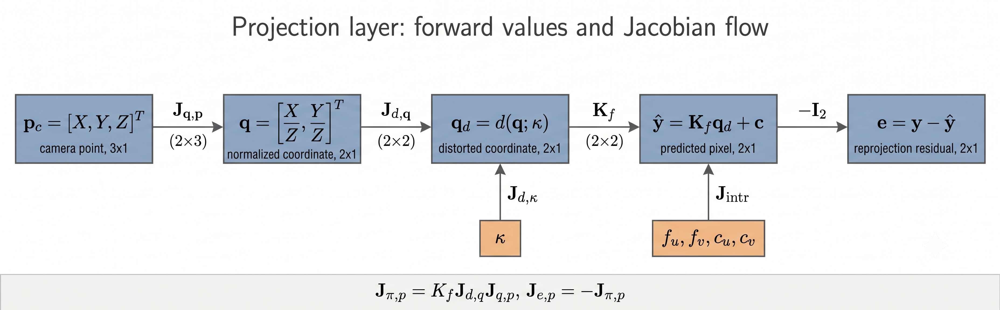

# 第 4 章：相机观测模型

第 2 章已经把 target corner 从 world / target frame 变到 camera frame：

$$
\tilde{\mathbf p}_{c_n,n,k,\ell}
=
\mathbf T_{c_nb}
\mathbf T_{bw}(t^{\mathrm{imu}}_{n,k})
\tilde{\mathbf p}_{w,\ell}.
$$

第 3 章又说明了 residual、Jacobian、information matrix 和 Gauss-Newton 线性系统之间的关系。

现在可以把两章接起来，进入 camera residual 的核心问题：

> 一个标定板角点为什么会产生
> $$
> \mathbf e^\pi
> =
> \mathbf y-\pi(\mathbf T_{c_nb}\mathbf T_{bw}\tilde{\mathbf p}_w),
> $$
> 以及它的 Jacobian 为什么是一串链式法则，最前面还有一个负号？

本章先建立相机观测的前向链路，再推第一层 Jacobian：

$$
\delta\mathbf e^\pi
=
-
\mathbf J_{\pi,\tilde{\mathbf p}_c}
\delta\tilde{\mathbf p}_c.
$$

随后把 $\delta\tilde{\mathbf p}_c$ 接到 Kalibr expression graph 里的 `boxMinus`、`boxTimes`、pose、extrinsic 和 time shift。pose spline 内部的时间导数与控制点 Jacobian 留到第 5 章；本章只固定 camera residual 进入这些变量块之前所需的链式入口。

## 4.1 本章依赖顺序

这一章适合按下面的链条阅读。

| 顺序 | 本章位置 | 主线位置 | 解决的问题 |
|---|---|---|---|
| 1 | 4.2 | 定义一个 residual 的数据入口 | 一个 camera observation 里有哪些量 |
| 2 | 4.3 | $\tilde{\mathbf p}_w\to\tilde{\mathbf p}_c$ | target point 怎么变成 camera point |
| 3 | 4.4 | $\tilde{\mathbf p}_c\to\hat{\mathbf y}$ | camera projection $\pi_n(\cdot)$ 做什么 |
| 4 | 4.5 | $\delta\tilde{\mathbf p}_c\to\delta\hat{\mathbf y}$ | projection Jacobian $\mathbf J_{\pi,\tilde{\mathbf p}_c}$ 从哪里来 |
| 5 | 4.5.1 | 填入 $\mathbf q\to\mathbf q_d$ 的局部 Jacobian | Kalibr 常见畸变模型里的 $\mathbf d(\cdot)$ 和 Jacobian 是什么 |
| 6 | 4.5.2 | camera 参数分支 $\delta\boldsymbol\eta_n\to\delta\hat{\mathbf y}$ | 如果内参/畸变也优化，Jacobian 如何反传到 camera 参数 |
| 7 | 4.6 | $\delta\hat{\mathbf y}\to\delta\mathbf e^\pi$ | residual 方向如何给出负号 |
| 8 | 4.7 | transform tangent $\to\delta\tilde{\mathbf p}_c$ | $\delta\tilde{\mathbf p}_c$ 如何接到 transform perturbation |
| 9 | 4.8 | product transform tangent $\to$ 具体变量块 tangent | 外参、body pose 和 time shift 的链式 Jacobian 骨架 |
| 10 | 4.9 | 数学链条 $\leftrightarrow$ 源码链条 | Kalibr 源码如何对应这些公式 |

第 4 章的主线是 camera residual。为了不提前混入连续时间 B-spline 的细节，本章暂不展开：

$$
\frac{\partial\mathbf T_{wb}(t)}{\partial\text{spline control points}},
\qquad
\frac{\partial\mathbf T_{wb}(t)}{\partial t}
$$

留给第 5 章。

## 4.2 一个角点观测

一个 camera residual 从单条角点观测开始。这里不看整批数据，只固定“第 $n$ 个 camera、第 $k$ 帧、第 $\ell$ 个角点”这一条观测。它给本章主线提供两个端点：测量端的像素 $\mathbf y_{n,k,\ell}$，以及几何端的已知 target point $\mathbf p_{w,\ell}$。

固定一个 camera、一个图像时刻和一个 target corner。下标约定为：

| 下标 | 含义 |
|---|---|
| $n$ | 第 $n$ 个 camera |
| $k$ | 这个 camera 的第 $k$ 帧图像 |
| $\ell$ | 标定板上的第 $\ell$ 个角点 |

这条观测给出一个二维像素测量：

$$
\mathbf y_{n,k,\ell}
=
\begin{bmatrix}
u_{n,k,\ell}\\
v_{n,k,\ell}
\end{bmatrix}
\in\mathbb R^2.
$$

标定板几何给了我们这个角点在 target / world frame 中的三维坐标。按照第 2 章的约定，target frame 在 cam-imu 标定里作为 world frame 使用，所以写成：

$$
\mathbf p_{w,\ell}
\in\mathbb R^3.
$$

Kalibr expression graph 里点通常用齐次形式传递：

$$
\tilde{\mathbf p}_{w,\ell}
=
\begin{bmatrix}
\mathbf p_{w,\ell}\\
1
\end{bmatrix}
\in\mathbb R^4.
$$

最后一维取 $1$，因为 target corner 是普通三维点，不是无穷远方向。后面看到 `homogeneousToKeypoint(...)` 时，它处理的是这类普通齐次点；在 Kalibr 的 target corner 链路中，刚体变换会保持最后一维为 $1$。

这一项 residual 依赖的状态包括：

| 状态 | 本章记号 | 在 camera residual 中的作用 |
|---|---|---|
| body pose | $\mathbf T_{wb}(t)$ | 给出当前 body 在 world 中的位置和姿态 |
| camera 外参 | $\mathbf T_{c_nb}$ | 从 body frame 变到第 $n$ 个 camera frame |
| camera time shift | $\Delta t_n$ | 决定在哪个 IMU / spline 时间取 pose |
| camera intrinsics / distortion | $\boldsymbol\eta_n$ | 决定 camera frame 点如何投影成像素 |

如果 target point 也被优化，它还会依赖 $\mathbf p_{w,\ell}$。cam-imu 标定里 target geometry 通常已知，本章先把 $\mathbf p_{w,\ell}$ 视为常量。

## 4.3 从 target point 到 camera point

几何链路的第一段，是把 target point 写成 camera frame 中的点：

$$
\tilde{\mathbf p}_{w,\ell}
\longrightarrow
\tilde{\mathbf p}_{c_n,n,k,\ell}.
$$

**target point** 指同一个物理角点 $P_\ell$ 在 target / world frame 中的坐标 $\mathbf p_{w,\ell}$。它来自标定板几何，在本章先视为已知常量。

**camera point** 指同一个物理角点在第 $n$ 个 camera frame 中的坐标 $\mathbf p_{c_n,n,k,\ell}$。它不是新的三维 landmark，而是同一个 target point 经过当前 body pose 和 camera 外参变换后的结果。相机投影只接受 camera frame 中的点，因此这一节的目标就是把 $\mathbf p_w$ 准备成 $\mathbf p_c$。

图像时间先被换成用于查询 pose spline 的 IMU 时间：

$$
t^{\mathrm{imu}}_{n,k}
=
t^{\mathrm{cam}}_{n,k}
+
\Delta t^{\mathrm{prior}}_n
+
\Delta t_n.
$$

各符号含义如下：

| 符号 | 含义 |
|---|---|
| $t^{\mathrm{cam}}_{n,k}$ | 第 $n$ 个 camera 第 $k$ 帧图像时间戳 |
| $\Delta t^{\mathrm{prior}}_n$ | 优化前给定的 camera-to-IMU time shift 初值 |
| $\Delta t_n$ | 优化中的 time shift correction design variable |

pose spline 给出：

$$
\mathbf T_{wb}(t^{\mathrm{imu}}_{n,k}),
$$

它是 body 到 world 的变换。camera residual 要把 world 点变到 body，所以先取 inverse：

$$
\mathbf T_{bw}(t^{\mathrm{imu}}_{n,k})
=
\mathbf T_{wb}(t^{\mathrm{imu}}_{n,k})^{-1}.
$$

第 $n$ 个 camera 的外参是：

$$
\mathbf T_{c_nb},
$$

它把 body frame 中的点变到 camera frame。

因此 world 到 camera 的变换是：

$$
\mathbf T_{c_nw}(t^{\mathrm{imu}}_{n,k})
=
\mathbf T_{c_nb}
\mathbf T_{bw}(t^{\mathrm{imu}}_{n,k}).
$$

于是 camera frame 中的齐次点是：

$$
\boxed{
\tilde{\mathbf p}_{c_n,n,k,\ell}
=
\mathbf T_{c_nw}(t^{\mathrm{imu}}_{n,k})
\tilde{\mathbf p}_{w,\ell}
=
\mathbf T_{c_nb}
\mathbf T_{bw}(t^{\mathrm{imu}}_{n,k})
\tilde{\mathbf p}_{w,\ell}.
}
$$

如果展开前三维，令：

$$
\mathbf T_{c_nb}
=
\begin{bmatrix}
\mathbf R_{c_nb} & \mathbf t_{c_nb}\\
\mathbf 0^\top & 1
\end{bmatrix},
\qquad
\mathbf T_{wb}
=
\begin{bmatrix}
\mathbf R_{wb} & \mathbf t_{wb}\\
\mathbf 0^\top & 1
\end{bmatrix},
$$

则：

$$
\mathbf p_{c_n,n,k,\ell}
=
\mathbf R_{c_nb}
\mathbf R_{wb}(t)^\top
\left(
\mathbf p_{w,\ell}
-
\mathbf t_{wb}(t)
\right)
+
\mathbf t_{c_nb}.
$$

这个展开式和第 2 章一致。它的几何顺序很直接：先把 world 点减去 body 原点，再转到 body frame，最后由 body-to-camera 外参转到 camera frame。

## 4.4 从 camera point 到预测像素

接下来，相机模型把 4.3 得到的 camera point 变成预测像素：

$$
\tilde{\mathbf p}_{c_n,n,k,\ell}
\longrightarrow
\hat{\mathbf y}_{n,k,\ell}.
$$

这一节只处理 forward projection：给定 camera frame 中的点，相机模型预测哪个像素。residual 方向放到 4.6，外参和 pose 的 Jacobian 放到 4.7-4.8；如果 camera 参数 $\boldsymbol\eta_n$ 本身也被优化，它的 Jacobian 分支会在 4.5.2 接回主线。

相机模型把 camera frame 中的点投影到像素。第 $n$ 个 camera 的投影函数记为：

$$
\pi_n(\cdot;\boldsymbol\eta_n).
$$

这里 $\boldsymbol\eta_n$ 表示第 $n$ 个 camera 的内参、畸变参数和可能的 shutter 参数。为了公式不太重，后面常写成：

$$
\pi_n(\tilde{\mathbf p}_{c_n})
$$

并默认它使用当前 camera 参数 $\boldsymbol\eta_n$。

预测像素是：

$$
\boxed{
\hat{\mathbf y}_{n,k,\ell}
=
\pi_n
\left(
\tilde{\mathbf p}_{c_n,n,k,\ell};
\boldsymbol\eta_n
\right).
}
$$

把上一节的点链路代入：

$$
\hat{\mathbf y}_{n,k,\ell}
=
\pi_n
\left(
\mathbf T_{c_nb}
\mathbf T_{bw}(t^{\mathrm{imu}}_{n,k})
\tilde{\mathbf p}_{w,\ell};
\boldsymbol\eta_n
\right).
$$

这是 camera residual 里的预测量。

为了看清 projection Jacobian，先从最简单的 pinhole camera 开始，暂时不考虑畸变。设：

$$
\mathbf p_c
=
\begin{bmatrix}
X\\Y\\Z
\end{bmatrix}.
$$

归一化平面坐标是：

$$
\mathbf q
=
\begin{bmatrix}
x\\y
\end{bmatrix}
=
\begin{bmatrix}
X/Z\\Y/Z
\end{bmatrix}.
$$

像素坐标是：

$$
\hat{\mathbf y}
=
\begin{bmatrix}
\hat u\\
\hat v
\end{bmatrix}
=
\begin{bmatrix}
f_u x+c_u\\
f_v y+c_v
\end{bmatrix}.
$$

如果有畸变，Kalibr 的 pinhole projection 逻辑可以抽象成一个 distortion mapping。记：

| 符号 | 含义 |
|---|---|
| $\mathbf d(\cdot;\boldsymbol\kappa)$ | distortion function，把未畸变归一化坐标映射成畸变后的归一化坐标 |
| $\boldsymbol\kappa$ | distortion 参数向量，不同模型维度不同，例如 radtan 是 $[k_1,k_2,p_1,p_2]^\top$ |
| $\mathbf q_d$ | distorted normalized coordinate，也就是畸变后的归一化平面坐标 |

于是：

$$
\mathbf q_d
=
\mathbf d(\mathbf q;\boldsymbol\kappa),
$$

然后：

$$
\hat{\mathbf y}
=
\begin{bmatrix}
f_u q_{d,x}+c_u\\
f_v q_{d,y}+c_v
\end{bmatrix}.
$$

Kalibr 支持多种 camera model。这里先抽出所有模型共有的链式结构：

$$
\mathbf p_c
\longrightarrow
\mathbf q
\longrightarrow
\mathbf q_d
\longrightarrow
\hat{\mathbf y}.
$$

4.5.1 再展开 Kalibr 常见 distortion class 的 $\mathbf J_{\mathbf d,\mathbf q}$ 和 $\mathbf J_{\mathbf d,\boldsymbol\kappa}$。阅读顺序因此是：先看清链条怎么接，再看每个 distortion model 在链条中填入什么 Jacobian。

下图把 forward path 和 Jacobian path 放在一起。读后面的公式时，可以把 $\mathbf J_{\mathbf d,\mathbf q}$ 看成 $\mathbf q\to\mathbf q_d$ 这一段的点分支，把 $\mathbf J_{\mathbf d,\boldsymbol\kappa}$ 看成从畸变参数侧向进入 distortion node 的参数分支。



### 4.4.1 Kalibr 支持的相机模型全集

本书主线只推 pinhole + radtan，但 Kalibr 支持更多相机模型。把它们放在一起看有一个关键好处：**整条 camera residual 链路只有投影节点 $\boldsymbol\pi$（以及它的参数向量 $\boldsymbol\eta$）随模型改变，其余部分完全不变**——$\mathbf T_{c_nb}\mathbf T_{bw}$ 几何链路、`boxMinus`、residual 方向 $\mathbf y-\hat{\mathbf y}$、time shift，对所有相机模型都一样。所以换相机模型，只是把 $\mathbf p_c\to\hat{\mathbf y}$ 这一段换成另一个闭式函数和另一组 Jacobian。

Kalibr 的相机模型 = **投影模型 × 畸变模型** 两层。源码分发在 `kalibr_common/ConfigReader.py`，支持的组合是：

| 投影模型 | 可配畸变 | 内参向量 $\boldsymbol\eta$ |
|---|---|---|
| `pinhole` | `radtan` / `equidistant` / `fov` / `none` | $[f_u,f_v,c_u,c_v]$ + 畸变参数 |
| `omni`（Mei 全向） | `radtan` / `none`（不支持 equidistant） | $[\xi,f_u,f_v,c_u,c_v]$ + 畸变参数 |
| `eucm`（Extended Unified） | 仅 `none` | $[\alpha,\beta,f_u,f_v,c_u,c_v]$ |
| `ds`（Double Sphere 双球） | 仅 `none` | $[\xi,\alpha,f_u,f_v,c_u,c_v]$ |

记 camera frame 中的点为 $\mathbf p_c=[X,Y,Z]^\top$，归一化到中间坐标 $\mathbf q=[q_x,q_y]^\top$ 后，像素都是 $\hat u=f_uq'_x+c_u,\ \hat v=f_vq'_y+c_v$（$\mathbf q'$ 是经过该模型畸变后的 $\mathbf q$；eucm/ds 无畸变即 $\mathbf q'=\mathbf q$）。四种投影模型的 $\mathbf q$ 闭式分别是：

**pinhole**（透视除法）：

$$
\mathbf q=\Big(\frac{X}{Z},\ \frac{Y}{Z}\Big).
$$

**omni（Mei 单位球模型）**：先把 $\mathbf p_c$ 投到单位球，再沿光轴平移 $\xi$ 后做透视除法。令 $d=\lVert\mathbf p_c\rVert$，

$$
\mathbf q=\Big(\frac{X}{Z+\xi d},\ \frac{Y}{Z+\xi d}\Big).
$$

$\xi$ 是镜面/球心偏移参数；$\xi=0$ 退回 pinhole。

**eucm（扩展统一模型）**：

$$
d=\sqrt{\beta(X^2+Y^2)+Z^2},
\qquad
\mathbf q=\Big(\frac{X}{\alpha d+(1-\alpha)Z},\ \frac{Y}{\alpha d+(1-\alpha)Z}\Big).
$$

$\alpha\in[0,1]$ 控制球面程度，$\beta$ 控制椭球拉伸；$(\alpha,\beta)=(0,1)$ 退回 pinhole。

**ds（双球模型）**：用两个球面级联描述大 FOV / 鱼眼。令

$$
d_1=\sqrt{X^2+Y^2+Z^2},
\qquad
d_2=\sqrt{X^2+Y^2+(\xi d_1+Z)^2},
$$

$$
\mathbf q=\Big(\frac{X}{\alpha d_2+(1-\alpha)(\xi d_1+Z)},\ \frac{Y}{\alpha d_2+(1-\alpha)(\xi d_1+Z)}\Big).
$$

pinhole 的三种畸变（radtan $[k_1,k_2,p_1,p_2]$、equidistant/Kannala-Brandt $[k_1,k_2,k_3,k_4]$、fov $[\omega]$）作用在 $\mathbf q\to\mathbf q'$ 这一步，闭式和 Jacobian 见 4.5.1。omni 的 radtan 同理作用在球面投影后的 $\mathbf q$ 上。eucm 和 ds 把畸变吸收进投影本身，所以没有独立畸变层。

对 Jacobian 而言，换模型只改两块：$\mathbf J_{\boldsymbol\pi,\mathbf p_c}=\partial\hat{\mathbf y}/\partial\mathbf p_c$（4.5 的投影 Jacobian）和 $\mathbf J_{\hat{\mathbf y},\boldsymbol\eta}$（4.5.2 的内参 Jacobian）。本书把 pinhole 这两块推到底；omni/eucm/ds 只是把上面的 $\mathbf q$ 闭式代进同一套链式法则，结构不变。

实现侧需要注意：当前 `ceres_cam_imu/` 只实现了 `pinhole-radtan`（`camera/pinhole_radtan.*`），其余模型尚未移植。要加新模型，只需新增一个提供 `project()` 和 `projectWithJacobian()` 的相机类，camera residual 的其余部分可直接复用。

## 4.5 projection Jacobian

从这里开始，forward model 转向一阶变化。首先处理 projection node 本身：

$$
\tilde{\mathbf p}_c
\xrightarrow{\pi}
\hat{\mathbf y}.
$$

目标是求出 camera point 轻微变化时预测像素的变化：

$$
\delta\tilde{\mathbf p}_c
\longrightarrow
\delta\hat{\mathbf y}.
$$

这个 Jacobian 是后面所有 camera residual Jacobian 的中间层。4.5.2 补上 camera 参数作为另一条输入分支时的 Jacobian；4.6 给 prediction Jacobian 加 residual 方向负号；4.7 再把 camera point 分支接到刚体变换扰动。

定义 projection 对 camera frame 齐次点的 Jacobian：

$$
\mathbf J_{\pi,\tilde{\mathbf p}_c}
\triangleq
\frac{\partial \pi(\tilde{\mathbf p}_c)}
{\partial \tilde{\mathbf p}_c}
\in
\mathbb R^{2\times 4}.
$$

这就是 Kalibr 源码里：

```cpp
cam.homogeneousToKeypoint(p, hat_y, J);
```

返回的 `J`。

先对无畸变 pinhole model 推一遍，可以直接看清这个矩阵的形状。若：

$$
\tilde{\mathbf p}_c
=
\begin{bmatrix}
X\\Y\\Z\\1
\end{bmatrix},
$$

则：

$$
\hat u
=
f_u\frac{X}{Z}+c_u,
\qquad
\hat v
=
f_v\frac{Y}{Z}+c_v.
$$

逐项求导：

$$
\frac{\partial\hat u}{\partial X}
=
\frac{f_u}{Z},
\qquad
\frac{\partial\hat u}{\partial Y}
=
0,
\qquad
\frac{\partial\hat u}{\partial Z}
=
-f_u\frac{X}{Z^2},
$$

$$
\frac{\partial\hat v}{\partial X}
=
0,
\qquad
\frac{\partial\hat v}{\partial Y}
=
\frac{f_v}{Z},
\qquad
\frac{\partial\hat v}{\partial Z}
=
-f_v\frac{Y}{Z^2}.
$$

因此：

$$
\boxed{
\mathbf J_{\pi,\tilde{\mathbf p}_c}
=
\begin{bmatrix}
\dfrac{f_u}{Z} & 0 & -\dfrac{f_uX}{Z^2} & 0\\
0 & \dfrac{f_v}{Z} & -\dfrac{f_vY}{Z^2} & 0
\end{bmatrix}.
}
$$

最后一列是 $0$，因为这里的普通 target corner 满足齐次最后一维 $w=1$，Kalibr 的 pinhole 实现对 `ph.head<3>()` 做 projection，而不是把 $[X,Y,Z,w]^\top$ 当成任意 projective point 后再除以 $w$。本书的 camera residual 推导只讨论这种普通三维点。

有畸变时，可以写成更通用的链式形式。归一化步骤：

$$
\mathbf q
=
\begin{bmatrix}
X/Z\\
Y/Z
\end{bmatrix},
$$

它的 Jacobian 是：

$$
\mathbf J_{\mathbf q,\mathbf p_c}
=
\begin{bmatrix}
\dfrac{1}{Z} & 0 & -\dfrac{X}{Z^2}\\
0 & \dfrac{1}{Z} & -\dfrac{Y}{Z^2}
\end{bmatrix}.
$$

相关量的维度如下：

| 符号 | 维度 | 含义 |
|---|---:|---|
| $\mathbf p_c=[X,Y,Z]^\top$ | $3\times1$ | camera frame 中的三维点 |
| $\tilde{\mathbf p}_c=[X,Y,Z,1]^\top$ | $4\times1$ | 同一个点的齐次坐标 |
| $\mathbf q=[x,y]^\top$ | $2\times1$ | 未畸变归一化坐标 |
| $\mathbf q_d=[q_{d,x},q_{d,y}]^\top$ | $2\times1$ | 畸变后的归一化坐标 |
| $\hat{\mathbf y}=[\hat u,\hat v]^\top$ | $2\times1$ | 预测像素 |
| $\mathbf J_{\mathbf q,\mathbf p_c}$ | $2\times3$ | 归一化步骤的 Jacobian |
| $\mathbf J_{\mathbf d,\mathbf q}$ | $2\times2$ | distortion 对归一化坐标的 Jacobian |
| $\mathbf K_f$ | $2\times2$ | 像素尺度矩阵 |

畸变函数的 Jacobian 记为：

$$
\mathbf J_{\mathbf d,\mathbf q}
\triangleq
\frac{\partial\mathbf d(\mathbf q;\boldsymbol\kappa)}
{\partial\mathbf q}
\in\mathbb R^{2\times2}.
$$

像素尺度矩阵为：

$$
\mathbf K_f
=
\begin{bmatrix}
f_u & 0\\
0 & f_v
\end{bmatrix}.
$$

将这三步写成一个复合函数：

$$
\mathbf p_c
\xrightarrow{\;\mathbf g\;}
\mathbf q
\xrightarrow{\;\mathbf d\;}
\mathbf q_d
\xrightarrow{\;\mathbf a\;}
\hat{\mathbf y}.
$$

其中：

$$
\mathbf q
=
\mathbf g(\mathbf p_c)
=
\begin{bmatrix}
X/Z\\Y/Z
\end{bmatrix},
$$

$$
\mathbf q_d
=
\mathbf d(\mathbf q;\boldsymbol\kappa),
$$

$$
\hat{\mathbf y}
=
\mathbf a(\mathbf q_d)
=
\mathbf K_f\mathbf q_d
+
\mathbf c,
\qquad
\mathbf c
=
\begin{bmatrix}
c_u\\c_v
\end{bmatrix}.
$$

对这个复合函数做一阶微分。第一步：

$$
\delta\mathbf q
=
\mathbf J_{\mathbf q,\mathbf p_c}\delta\mathbf p_c.
$$

第二步：

$$
\delta\mathbf q_d
=
\mathbf J_{\mathbf d,\mathbf q}\delta\mathbf q.
$$

第三步：

$$
\delta\hat{\mathbf y}
=
\delta(\mathbf K_f\mathbf q_d+\mathbf c).
$$

对点 $\mathbf p_c$ 求导时，$\mathbf K_f$ 和 $\mathbf c$ 都是常量，所以：

$$
\delta\hat{\mathbf y}
=
\mathbf K_f\delta\mathbf q_d.
$$

把前两步代入：

$$
\delta\hat{\mathbf y}
=
\mathbf K_f
\mathbf J_{\mathbf d,\mathbf q}
\mathbf J_{\mathbf q,\mathbf p_c}
\delta\mathbf p_c.
$$

而 Jacobian 的定义就是：

$$
\delta\hat{\mathbf y}
=
\mathbf J_{\pi,\mathbf p_c}
\delta\mathbf p_c.
$$

比较这两个式子，得到：

$$
\boxed{
\mathbf J_{\pi,\mathbf p_c}
=
\mathbf K_f
\mathbf J_{\mathbf d,\mathbf q}
\mathbf J_{\mathbf q,\mathbf p_c}
\in\mathbb R^{2\times3}.
}
$$

如果写成齐次点 Jacobian，就是在右侧补一列 $0$：

$$
\mathbf J_{\pi,\tilde{\mathbf p}_c}
=
\begin{bmatrix}
\mathbf J_{\pi,\mathbf p_c} & \mathbf 0_{2\times1}
\end{bmatrix}.
$$

对 intrinsics / distortion 参数的 Jacobian 也由同一条链路得到。比如 pinhole 中：

$$
\frac{\partial\hat{\mathbf y}}
{\partial[f_u,f_v,c_u,c_v]}
=
\begin{bmatrix}
q_{d,x} & 0 & 1 & 0\\
0 & q_{d,y} & 0 & 1
\end{bmatrix},
$$

而畸变参数满足：

$$
\frac{\partial\hat{\mathbf y}}
{\partial\boldsymbol\kappa}
=
\mathbf K_f
\frac{\partial\mathbf d(\mathbf q;\boldsymbol\kappa)}
{\partial\boldsymbol\kappa}.
$$

这些 camera 参数 Jacobian 不改变 residual 的几何链路；它们说明的是另一条变量分支：当 camera intrinsics / distortion 也设为 design variable 时，reprojection residual 还会向这些变量块贡献 Jacobian。

### 4.5.1 Kalibr 里的具体畸变模型

这一小节填入 4.5 链式法则里的 distortion node：

$$
\mathbf q
\xrightarrow{\mathbf d(\cdot;\boldsymbol\kappa)}
\mathbf q_d.
$$

每个模型都需要两类局部 Jacobian：对点的 $\mathbf J_{\mathbf d,\mathbf q}$，以及在畸变参数也优化时对参数的 $\mathbf J_{\mathbf d,\boldsymbol\kappa}$。进入像素层时它们要左乘 $\mathbf K_f$；进入 residual 时再乘 4.6 的负号。

上一节用：

$$
\mathbf q_d
=
\mathbf d(\mathbf q;\boldsymbol\kappa)
$$

这个记号把畸变模型抽象成一个节点，并不是忽略源码细节。Kalibr 支持多种 projection / distortion 组合；源码里每个 distortion class 都实现三件事：

| 接口 | 数学含义 |
|---|---|
| `distort(y)` | 给定未畸变归一化坐标 $\mathbf q$，原地改成畸变坐标 $\mathbf q_d$ |
| `distort(y, J)` | 同时给出 $\mathbf J_{\mathbf d,\mathbf q}=\partial\mathbf q_d/\partial\mathbf q$ |
| `distortParameterJacobian(y, J)` | 给出 $\mathbf J_{\mathbf d,\boldsymbol\kappa}=\partial\mathbf q_d/\partial\boldsymbol\kappa$ |

下图只画直观效果，不代表某个真实相机的参数。灰色网格是未畸变的 normalized plane 坐标 $\mathbf q$，彩色网格是畸变后的 $\mathbf q_d$。图的作用是把后面的公式和几何变化对应起来。


#### NoDistortion

无畸变模型就是 distortion node 的 identity 情形：$\mathbf q$ 原样进入像素尺度层，并且没有畸变参数分支。

最简单的是无畸变模型：

$$
\mathbf q_d
=
\mathbf q.
$$

所以：

$$
\mathbf J_{\mathbf d,\mathbf q}
=
\mathbf I_2,
\qquad
\mathbf J_{\mathbf d,\boldsymbol\kappa}
\in
\mathbb R^{2\times0}.
$$

这对应 `NoDistortion.hpp`：`distort(y, J)` 返回 identity，参数 Jacobian 是一个 $2\times0$ 空矩阵。

#### RadialTangentialDistortion

pinhole+radtan 相机的 distortion node 需要同时给出 $\mathbf J_{\mathbf d,\mathbf q}^{\mathrm{rt}}$ 和 $\mathbf J_{\mathbf d,\boldsymbol\kappa}^{\mathrm{rt}}$。前者把 camera point 的扰动传到像素，后者把 residual 传到 radtan 参数。

Kalibr 常用的 pinhole+radtan 模型在源码里对应：

```text
aslam_cv/aslam_cameras/include/aslam/cameras/implementation/RadialTangentialDistortion.hpp
```

令未畸变归一化坐标为：

$$
\mathbf q
=
\begin{bmatrix}
x\\y
\end{bmatrix},
\qquad
r^2
=
x^2+y^2,
\qquad
r^4
=
(r^2)^2.
$$

畸变参数为：

$$
\boldsymbol\kappa_{\mathrm{rt}}
=
\begin{bmatrix}
k_1\\k_2\\p_1\\p_2
\end{bmatrix}.
$$

源码里的径向项是：

$$
\alpha
\triangleq
k_1r^2+k_2r^4.
$$

畸变后的归一化坐标是：

$$
\boxed{
\begin{aligned}
x_d
&=
x
+
x\alpha
+
2p_1xy
+
p_2(r^2+2x^2),
\\
y_d
&=
y
+
y\alpha
+
2p_2xy
+
p_1(r^2+2y^2).
\end{aligned}
}
$$

这就是源码中：

```cpp
y[0] += y[0] * rad_dist_u
      + 2.0 * _p1 * mxy_u
      + _p2 * (rho2_u + 2.0 * mx2_u);
y[1] += y[1] * rad_dist_u
      + 2.0 * _p2 * mxy_u
      + _p1 * (rho2_u + 2.0 * my2_u);
```

的数学形式。

现在推 $\mathbf J_{\mathbf d,\mathbf q}$。先求：

$$
\frac{\partial\alpha}{\partial x}
=
2k_1x+4k_2xr^2,
\qquad
\frac{\partial\alpha}{\partial y}
=
2k_1y+4k_2yr^2.
$$

对 $x_d$ 求导：

$$
\begin{aligned}
\frac{\partial x_d}{\partial x}
&=
1
+
\alpha
+
x\frac{\partial\alpha}{\partial x}
+
2p_1y
+
6p_2x
\\
&=
1+\alpha
+2k_1x^2
+4k_2x^2r^2
+2p_1y
+6p_2x,
\\
\frac{\partial x_d}{\partial y}
&=
x\frac{\partial\alpha}{\partial y}
+
2p_1x
+
2p_2y
\\
&=
2k_1xy
+4k_2xyr^2
+2p_1x
+2p_2y.
\end{aligned}
$$

对 $y_d$ 求导：

$$
\begin{aligned}
\frac{\partial y_d}{\partial x}
&=
y\frac{\partial\alpha}{\partial x}
+
2p_2y
+
2p_1x
\\
&=
2k_1xy
+4k_2xyr^2
+2p_1x
+2p_2y,
\\
\frac{\partial y_d}{\partial y}
&=
1
+
\alpha
+
y\frac{\partial\alpha}{\partial y}
+
2p_2x
+
6p_1y
\\
&=
1+\alpha
+2k_1y^2
+4k_2y^2r^2
+6p_1y
+2p_2x.
\end{aligned}
$$

所以：

$$
\boxed{
\mathbf J_{\mathbf d,\mathbf q}^{\mathrm{rt}}
=
\begin{bmatrix}
1+\alpha+2k_1x^2+4k_2x^2r^2+2p_1y+6p_2x
&
2k_1xy+4k_2xyr^2+2p_1x+2p_2y
\\
2k_1xy+4k_2xyr^2+2p_1x+2p_2y
&
1+\alpha+2k_1y^2+4k_2y^2r^2+6p_1y+2p_2x
\end{bmatrix}.
}
$$

再看畸变参数 Jacobian。因为：

$$
x_d
=
x
+
x(k_1r^2+k_2r^4)
+
2p_1xy
+
p_2(r^2+2x^2),
$$

所以对 $[k_1,k_2,p_1,p_2]$ 求导：

$$
\frac{\partial x_d}{\partial\boldsymbol\kappa_{\mathrm{rt}}}
=
\begin{bmatrix}
xr^2 & xr^4 & 2xy & r^2+2x^2
\end{bmatrix}.
$$

同理：

$$
\frac{\partial y_d}{\partial\boldsymbol\kappa_{\mathrm{rt}}}
=
\begin{bmatrix}
yr^2 & yr^4 & r^2+2y^2 & 2xy
\end{bmatrix}.
$$

因此：

$$
\boxed{
\mathbf J_{\mathbf d,\boldsymbol\kappa}^{\mathrm{rt}}
=
\begin{bmatrix}
xr^2 & xr^4 & 2xy & r^2+2x^2\\
yr^2 & yr^4 & r^2+2y^2 & 2xy
\end{bmatrix}.
}
$$

经过 pixel scaling 后：

$$
\boxed{
\frac{\partial\hat{\mathbf y}}
{\partial\boldsymbol\kappa_{\mathrm{rt}}}
=
\mathbf K_f
\mathbf J_{\mathbf d,\boldsymbol\kappa}^{\mathrm{rt}}.
}
$$

camera residual 使用测量减预测，所以 residual 对 radtan 参数的 Jacobian 是：

$$
\boxed{
\frac{\partial\mathbf e^\pi}
{\partial\boldsymbol\kappa_{\mathrm{rt}}}
=
-
\mathbf K_f
\mathbf J_{\mathbf d,\boldsymbol\kappa}^{\mathrm{rt}}.
}
$$

#### EquidistantDistortion

equidistant 也填入同一个 distortion node，但几何直觉和 radtan 不同：它保持方向不变，只重新映射离光轴的半径。推导会先把 $\mathbf q$ 写成“半径 $\times$ 方向”，再从径向缩放得到 $\mathbf J_{\mathbf d,\mathbf q}^{\mathrm{eq}}$ 和 $\mathbf J_{\mathbf d,\boldsymbol\kappa}^{\mathrm{eq}}$。

Kalibr 的 equidistant 模型在：

```text
aslam_cv/aslam_cameras/include/aslam/cameras/implementation/EquidistantDistortion.hpp
```

令：

$$
r=\sqrt{x^2+y^2},
\qquad
\theta=\arctan r.
$$

参数为：

$$
\boldsymbol\kappa_{\mathrm{eq}}
=
\begin{bmatrix}
k_1\\k_2\\k_3\\k_4
\end{bmatrix}.
$$

源码中的模型可以写成：

$$
\theta_d
=
\theta
\left(
1
+k_1\theta^2
+k_2\theta^4
+k_3\theta^6
+k_4\theta^8
\right),
$$

这个模型保持归一化平面上的方向不变，只改变点离光轴的半径。先把 $\mathbf q$ 写成“半径乘方向”的形式。若 $r>0$，令：

$$
\mathbf u
\triangleq
\frac{\mathbf q}{r},
\qquad
\|\mathbf u\|=1.
$$

于是：

$$
\mathbf q
=
r\mathbf u.
$$

equidistant distortion 把原来的半径 $r$ 映射成畸变后的半径 $\theta_d$，但保持方向 $\mathbf u$ 不变，所以：

$$
\mathbf q_d
=
\theta_d\mathbf u.
$$

把 $\mathbf u=\mathbf q/r$ 代回去：

$$
\mathbf q_d
=
\theta_d\frac{\mathbf q}{r}
=
\frac{\theta_d}{r}\mathbf q.
$$

因此下面的式子就是“方向不变、半径从 $r$ 变成 $\theta_d$”的等价写法。为了后续写 Jacobian 方便，把比例系数命名为 $s(r)$：

$$
\boxed{
\mathbf q_d
=
s(r)\mathbf q,
\qquad
s(r)
=
\frac{\theta_d}{r}.
}
$$

这里 $s(r)$ 是一个标量，$\mathbf q_d$ 和 $\mathbf q$ 都在 $\mathbb R^2$。

当 $r$ 很小时，源码使用 $s=1$ 作为极限值。这个分支来自数学极限：

$$
\theta
=
\arctan r
=
r+O(r^3),
$$

且：

$$
\theta_d
=
\theta
\left(
1+k_1\theta^2+k_2\theta^4+k_3\theta^6+k_4\theta^8
\right)
=
r+O(r^3).
$$

所以：

$$
\lim_{r\to0}
s(r)
=
\lim_{r\to0}
\frac{\theta_d}{r}
=
1.
$$

直接在 $r=0$ 处计算 $\theta_d/r$ 会得到 $0/0$。源码里的 $s=1$ 使用这个连续极限，同时避免数值除零。几何上，这表示光轴附近的一阶映射近似为 identity。

这种“径向缩放”模型的点 Jacobian 可以从一阶微分直接得到。先不代入 equidistant 的具体 $s(r)$，只看一个通用模型：

$$
\mathbf q_d
=
s(r)\mathbf q,
\qquad
r
=
\|\mathbf q\|
=
\sqrt{x^2+y^2}.
$$

下图画出径向缩放模型的 Jacobian 路线。它适用于 equidistant 和 FOV 这类 $\mathbf q_d=s(r,\cdot)\mathbf q$ 的模型：$\mathbf q$ 一条路直接进入乘积，产生 $s\,\delta\mathbf q$；另一条路先变成半径 $r$，再变成尺度 $s$，最后产生 $\mathbf q\,\delta s$。


对 $r$ 做一阶微分：

$$
\delta r
=
\frac{\partial r}{\partial\mathbf q}
\delta\mathbf q
=
\frac{\mathbf q^\top}{r}\delta\mathbf q,
\qquad r>0.
$$

这一步来自 $r=\sqrt{x^2+y^2}$。展开看：

$$
\frac{\partial r}{\partial x}
=
\frac{x}{\sqrt{x^2+y^2}}
=
\frac{x}{r},
\qquad
\frac{\partial r}{\partial y}
=
\frac{y}{r}.
$$

因此：

$$
\frac{\partial r}{\partial\mathbf q}
=
\begin{bmatrix}
\dfrac{x}{r} & \dfrac{y}{r}
\end{bmatrix}
=
\frac{\mathbf q^\top}{r}.
$$

如果写成一阶变化，就是：

$$
\delta r
=
\frac{x}{r}\delta x
+
\frac{y}{r}\delta y
=
\frac{1}{r}
\begin{bmatrix}
x&y
\end{bmatrix}
\begin{bmatrix}
\delta x\\
\delta y
\end{bmatrix}
=
\frac{\mathbf q^\top}{r}\delta\mathbf q.
$$

对 $\mathbf q_d=s(r)\mathbf q$ 做乘积微分：

$$
\delta\mathbf q_d
=
s(r)\delta\mathbf q
+
\mathbf q\,\delta s.
$$

这一步只是普通乘积法则。$s(r)$ 是标量，$\mathbf q$ 是二维向量，因此：

$$
\delta(s\mathbf q)
=
(\delta s)\mathbf q+s\delta\mathbf q.
$$

本书把标量乘向量写成 $\mathbf q\,\delta s$ 或 $(\delta s)\mathbf q$ 都是同一个量。

而：

$$
\delta s
=
s'(r)\delta r
=
s'(r)\frac{\mathbf q^\top}{r}\delta\mathbf q.
$$

这里使用单变量链式法则：$s$ 只通过 $r$ 依赖 $\mathbf q$，所以 $\delta s=s'(r)\delta r$。

现在代回 $\delta\mathbf q_d=s(r)\delta\mathbf q+\mathbf q\,\delta s$。其中第二项的矩阵形状可以逐项看清楚：

$$
\mathbf q\,\delta s
=
\mathbf q
\left(
s'(r)\frac{\mathbf q^\top}{r}\delta\mathbf q
\right)
=
\left(
\frac{s'(r)}{r}
\mathbf q\mathbf q^\top
\right)
\delta\mathbf q.
$$

所以：

$$
\delta\mathbf q_d
=
s(r)\delta\mathbf q
+
\left(
\frac{s'(r)}{r}
\mathbf q\mathbf q^\top
\right)
\delta\mathbf q
=
\left(
s(r)\mathbf I_2
+
\frac{s'(r)}{r}
\mathbf q\mathbf q^\top
\right)
\delta\mathbf q.
$$

所以径向缩放模型的点 Jacobian 是：

$$
\boxed{
\mathbf J_{\mathbf d,\mathbf q}^{\mathrm{radial}}
=
s(r)\mathbf I_2
+
\frac{s'(r)}{r}
\mathbf q\mathbf q^\top.
}
$$

这个式子的维度是 $2\times2$。它默认 $r>0$。当 $r$ 很小时，源码使用极限分支，避免直接计算含 $1/r$ 的项。

如果把矩阵展开成 component form，就是：

$$
\mathbf J_{\mathbf d,\mathbf q}^{\mathrm{radial}}
=
\begin{bmatrix}
s+\dfrac{s'}{r}x^2 & \dfrac{s'}{r}xy\\
\dfrac{s'}{r}xy & s+\dfrac{s'}{r}y^2
\end{bmatrix}.
$$

这个展开式和矩阵式完全等价；矩阵式更容易复用到 equidistant 和 FOV。

对 equidistant，令：

$$
h(\theta)
=
1+k_1\theta^2+k_2\theta^4+k_3\theta^6+k_4\theta^8,
\qquad
\theta_d=\theta h(\theta).
$$

先求 $\theta_d$ 对 $r$ 的导数。因为：

$$
\frac{d\theta}{dr}
=
\frac{1}{1+r^2},
$$

而：

$$
\frac{d\theta_d}{d\theta}
=
\frac{d}{d\theta}
\left[
\theta
\left(
1+k_1\theta^2+k_2\theta^4+k_3\theta^6+k_4\theta^8
\right)
\right].
$$

逐项求导：

$$
\frac{d\theta_d}{d\theta}
=
1
+3k_1\theta^2
+5k_2\theta^4
+7k_3\theta^6
+9k_4\theta^8.
$$

所以由单变量链式法则：

$$
\frac{d\theta_d}{dr}
=
\frac{
1+3k_1\theta^2+5k_2\theta^4+7k_3\theta^6+9k_4\theta^8
}
{1+r^2},
$$

再由：

$$
s(r)
=
\frac{\theta_d(r)}{r},
$$

使用商法则：

$$
s'(r)
=
\frac{
r\,d\theta_d/dr-\theta_d
}
{r^2}.
$$

参数 Jacobian 也从 $s(r)\mathbf q$ 直接来。对参数 $k_i$ 求导时，$\mathbf q$ 和 $r$ 固定，只有 $\theta_d$ 里的系数变。因为：

$$
\frac{\partial \theta_d}{\partial k_i}
=
\theta^{2i+1},
\qquad
i=1,2,3,4,
$$

又因为 $\mathbf q_d=(\theta_d/r)\mathbf q$，所以：

$$
\frac{\partial\mathbf q_d}{\partial k_i}
=
\frac{\theta^{2i+1}}{r}\mathbf q.
$$

于是参数 Jacobian 是：

$$
\boxed{
\mathbf J_{\mathbf d,\boldsymbol\kappa}^{\mathrm{eq}}
=
\begin{bmatrix}
x\theta^3/r & x\theta^5/r & x\theta^7/r & x\theta^9/r\\
y\theta^3/r & y\theta^5/r & y\theta^7/r & y\theta^9/r
\end{bmatrix}.
}
$$

这个 Jacobian 的维度是 $2\times4$。这个紧凑写法和源码里的 `distortParameterJacobian(...)` 一致。源码中的点 Jacobian 是同一个径向缩放导数的完全展开形式。

#### FovDistortion

FOV 模型同样是方向不变、半径重映射的 distortion node。它和 equidistant 的区别在于参数只有一个 $w$，半径映射函数换成 FOV 公式。因此这里复用前面的径向缩放 Jacobian，只替换 $s(r,\cdot)$ 及其导数。

FOV 模型在：

```text
aslam_cv/aslam_cameras/include/aslam/cameras/implementation/FovDistortion.hpp
```

它只有一个参数 $w$。这里的 $w$ 是 FOV distortion parameter，不是齐次点 $\tilde{\mathbf p}=[\mathbf p^\top,w]^\top$ 里的最后一维；在 FOV 小节中沿用源码的这个参数名。

FOV 模型和 equidistant 一样，也是“方向不变、半径重映射”的模型。令未畸变归一化坐标为：

$$
\mathbf q
=
\begin{bmatrix}
x\\y
\end{bmatrix},
\qquad
r
=
\|\mathbf q\|
=
\sqrt{x^2+y^2}.
$$

当 $r>0$ 时，单位方向为：

$$
\mathbf u
\triangleq
\frac{\mathbf q}{r}.
$$

FOV 模型先把未畸变半径 $r$ 映射成畸变半径 $r_d$：

$$
\boxed{
r_d
=
\frac{\arctan\left(2r\tan(w/2)\right)}{w}.
}
$$

方向 $\mathbf u$ 不变，所以：

$$
\mathbf q_d
=
r_d\mathbf u
=
\frac{r_d}{r}\mathbf q.
$$

为了写 Jacobian，定义：

$$
a
=
\tan\frac{w}{2},
\qquad
b
=
2ar
=
2r\tan\frac{w}{2},
\qquad
A
\triangleq
\arctan b.
$$

那么：

$$
r_d
=
\frac{A}{w},
\qquad
s(r,w)
\triangleq
\frac{r_d}{r}
=
\frac{A}{rw}.
$$

于是 FOV distortion 可以写成径向缩放：

$$
\boxed{
\mathbf q_d
=
s(r,w)\mathbf q,
\qquad
s(r,w)
=
\frac{\arctan(2ar)}
{rw}.
}
$$

这一步和 equidistant 的结构相同：先把半径映射成 $r_d$，再写成 $\mathbf q_d=(r_d/r)\mathbf q$。

源码对 $w\to0$ 和 $r\to0$ 做了极限分支，避免数值除零。两个极限的含义分别是：

1. 当 $w\to0$ 时：

$$
a
=
\tan\frac{w}{2}
=
\frac{w}{2}+O(w^3),
\qquad
b
=
2ar
=
rw+O(w^3).
$$

因此：

$$
A
=
\arctan b
=
rw+O(w^3),
\qquad
s(r,w)
=
\frac{A}{rw}
\to
1.
$$

所以 $w$ 很小时，FOV distortion 退化成无畸变，源码令 $\mathbf J_{\mathbf d,\mathbf q}=\mathbf I_2$，参数 Jacobian 近似为零。

2. 当 $r\to0$ 且 $w$ 固定时：

$$
A
=
\arctan(2ar)
=
2ar+O(r^3),
$$

所以：

$$
s(r,w)
=
\frac{A}{rw}
\to
\frac{2a}{w}
=
\frac{2\tan(w/2)}{w}.
$$

这就是源码里小半径分支使用的 scaling：

$$
r\approx0:
\qquad
\mathbf q_d
\approx
\frac{2\tan(w/2)}{w}\mathbf q.
$$

它的点 Jacobian 仍然是径向缩放形式：

$$
\mathbf J_{\mathbf d,\mathbf q}^{\mathrm{fov}}
=
s(r,w)\mathbf I_2
+
\frac{s_r'(r,w)}{r}
\mathbf q\mathbf q^\top.
$$

这个式子来自前面推过的通用径向缩放 Jacobian。还需要写出 FOV 自己的 $s_r'(r,w)$。对点求导时，$w$ 固定，因此 $a=\tan(w/2)$ 也固定。

先求：

$$
\frac{\partial A}{\partial r}
=
\frac{\partial}{\partial r}
\arctan(2ar)
=
\frac{2a}{1+(2ar)^2}
=
\frac{2a}{1+4a^2r^2}.
$$

由于：

$$
s(r,w)
=
\frac{A(r)}{rw}
=
\frac{1}{w}\frac{A(r)}{r},
$$

用商法则：

$$
\boxed{
s_r'(r,w)
=
\frac{\partial s}{\partial r}
=
\frac{1}{w}
\frac{
r\,\partial A/\partial r-A
}
{r^2}
=
\frac{
\dfrac{2ar}{1+4a^2r^2}
-
\arctan(2ar)
}
{r^2w}.
}
$$

代回径向缩放 Jacobian：

$$
\boxed{
\mathbf J_{\mathbf d,\mathbf q}^{\mathrm{fov}}
=
s(r,w)\mathbf I_2
+
\frac{1}{r}
\frac{
\dfrac{2ar}{1+4a^2r^2}
-
\arctan(2ar)
}
{r^2w}
\mathbf q\mathbf q^\top.
}
$$

为了和源码中 `duf_du`、`duf_dv` 这样的展开形式对上，把它写成 component form。令 $A=\arctan(2ar)$，则：

$$
\frac{\partial x_d}{\partial x}
=
\frac{A}{wr}
-
\frac{x^2A}{wr^3}
+
\frac{2ax^2}
{wr^2(1+4a^2r^2)},
$$

$$
\frac{\partial x_d}{\partial y}
=
-
\frac{xyA}{wr^3}
+
\frac{2axy}
{wr^2(1+4a^2r^2)},
$$

$$
\frac{\partial y_d}{\partial x}
=
-
\frac{xyA}{wr^3}
+
\frac{2axy}
{wr^2(1+4a^2r^2)},
$$

$$
\frac{\partial y_d}{\partial y}
=
\frac{A}{wr}
-
\frac{y^2A}{wr^3}
+
\frac{2ay^2}
{wr^2(1+4a^2r^2)}.
$$

这些式子就是源码非退化分支中 `duf_du`、`duf_dv`、`dvf_du`、`dvf_dv` 的数学形式，其中源码变量 `u`、`v` 分别对应本书的 $x$、$y$。

现在推参数 Jacobian。因为：

$$
\mathbf q_d
=
s(r,w)\mathbf q,
$$

所以对 $w$ 求导时，$\mathbf q$ 和 $r$ 都固定，只有 $s(r,w)$ 随 $w$ 变：

$$
\mathbf J_{\mathbf d,w}^{\mathrm{fov}}
\triangleq
\frac{\partial\mathbf q_d}{\partial w}
=
\mathbf q
\frac{\partial s}{\partial w}
\in\mathbb R^{2\times1}.
$$

先推 $\partial s/\partial w$。仍令：

$$
b
=
2ar
=
2r\tan\frac{w}{2}.
$$

则：

$$
s(r,w)
=
\frac{\arctan b}{rw}.
$$

因为：

$$
\frac{\partial b}{\partial w}
=
2r\cdot\frac{1}{2}\sec^2\frac{w}{2}
=
r\left(1+a^2\right).
$$

再令 $A=\arctan b$，则：

$$
\frac{\partial A}{\partial w}
=
\frac{1}{1+b^2}
\frac{\partial b}{\partial w}
=
\frac{r(1+a^2)}
{1+4a^2r^2}.
$$

由于：

$$
s(r,w)
=
\frac{1}{r}\frac{A(w)}{w},
$$

再次用商法则：

$$
\frac{\partial s}{\partial w}
=
\frac{\partial}{\partial w}
\left(
\frac{\arctan b}{rw}
\right)
=
\frac{1}{r}
\left[
\frac{1}{w}
\frac{\partial A}{\partial w}
-
\frac{\arctan b}{w^2}
\right].
$$

代入 $\partial A/\partial w$ 和 $b=2ar$：

$$
\boxed{
\frac{\partial s}{\partial w}
=
\frac{1+a^2}
{w\left(1+4a^2r^2\right)}
-
\frac{\arctan(2ar)}
{rw^2}.
}
$$

因此：

$$
\boxed{
\mathbf J_{\mathbf d,w}^{\mathrm{fov}}
=
\begin{bmatrix}
x\\y
\end{bmatrix}
\left[
\frac{1+a^2}
{w\left(1+4a^2r^2\right)}
-
\frac{\arctan(2ar)}
{rw^2}
\right].
}
$$

这就是源码中非退化分支 `dxd_d_w`、`dyd_d_w` 的紧凑形式：

$$
\frac{\partial x_d}{\partial w}
=
x
\left[
\frac{1+a^2}
{w(1+4a^2r^2)}
-
\frac{A}{rw^2}
\right],
\qquad
\frac{\partial y_d}{\partial w}
=
y
\left[
\frac{1+a^2}
{w(1+4a^2r^2)}
-
\frac{A}{rw^2}
\right].
$$

源码对 $w\to0$ 和 $r\to0$ 另外写了极限分支；数学上它们是在避免上式中的除零。主线推导使用的是非退化区域：

$$
r>0,
\qquad
w\ne0.
$$

从非退化公式也可以看出 $w\to0$ 时参数 Jacobian 为什么趋近零。因为 $s(r,w)=1+O(w^2)$，所以：

$$
\frac{\partial s}{\partial w}
=
O(w)
\to
0.
$$

因此源码在 $w^2$ 很小时令 distortion parameter Jacobian 为零，使用的正是这个极限。

接到像素和 residual 的总链式结构：

$$
\frac{\partial\hat{\mathbf y}}{\partial w}
=
\mathbf K_f
\mathbf J_{\mathbf d,w}^{\mathrm{fov}},
\qquad
\frac{\partial\mathbf e^\pi}{\partial w}
=
-
\mathbf K_f
\mathbf J_{\mathbf d,w}^{\mathrm{fov}}.
$$

至此，Kalibr 常见 distortion class 在本章中的 Jacobian 覆盖如下：

| distortion class | $\mathbf J_{\mathbf d,\mathbf q}$ | $\mathbf J_{\mathbf d,\boldsymbol\kappa}$ |
|---|---|---|
| `NoDistortion` | $\mathbf I_2$，维度 $2\times2$ | 空矩阵，维度 $2\times0$ |
| `RadialTangentialDistortion` | 已展开闭式公式，维度 $2\times2$ | 已展开闭式公式，维度 $2\times4$ |
| `EquidistantDistortion` | 径向缩放公式 $s\mathbf I_2+\dfrac{s'}{r}\mathbf q\mathbf q^\top$，维度 $2\times2$ | 已展开紧凑公式，维度 $2\times4$ |
| `FovDistortion` | 径向缩放公式 $s\mathbf I_2+\dfrac{s_r'}{r}\mathbf q\mathbf q^\top$，维度 $2\times2$ | 已展开非退化公式，维度 $2\times1$ |

这些都是 projection 链条中的局部 Jacobian。进入像素预测时还要左乘 $\mathbf K_f$；进入 residual 时再因为 $\mathbf e^\pi=\mathbf y-\hat{\mathbf y}$ 多一个负号。

### 4.5.2 如果 camera 参数也加入优化

projection 对 camera point 的 Jacobian 和各个 distortion model 的局部 Jacobian 已经就位。还差一条常被忽略的分支：当 camera intrinsics / distortion 作为 design variable 时，同一个 reprojection residual 还会向 camera 参数传播 Jacobian。

这不是新的 residual，也不是新的几何链路，而是 projection node 的第二个输入分支：

$$
\tilde{\mathbf p}_c
\longrightarrow
\hat{\mathbf y},
\qquad
\boldsymbol\eta_n
\longrightarrow
\hat{\mathbf y}.
$$

前一条分支描述 camera point 变化如何影响像素；这一条分支描述 camera 参数变化如何影响像素。做这个 Jacobian 时，固定 camera point $\tilde{\mathbf p}_c$，只扰动 camera 参数。

把第 $n$ 个 camera 的参数拆成两部分：

$$
\boldsymbol\eta_n
\triangleq
\begin{bmatrix}
\boldsymbol\gamma_n\\
\boldsymbol\kappa_n
\end{bmatrix},
\qquad
\boldsymbol\gamma_n
\triangleq
\begin{bmatrix}
f_u\\f_v\\c_u\\c_v
\end{bmatrix}.
$$

这里 $\boldsymbol\gamma_n$ 是 pinhole intrinsics，$\boldsymbol\kappa_n$ 是 distortion 参数。不同 distortion model 的 $\boldsymbol\kappa_n$ 维度不同：

| distortion model | $\dim(\boldsymbol\kappa_n)$ |
|---|---:|
| no distortion | $0$ |
| radtan | $4$ |
| equidistant | $4$ |
| FOV | $1$ |

先回到 forward formula：

$$
\mathbf q_d
=
\mathbf d(\mathbf q;\boldsymbol\kappa_n),
\qquad
\hat{\mathbf y}
=
\mathbf K_f\mathbf q_d+\mathbf c,
$$

其中：

$$
\mathbf K_f
=
\begin{bmatrix}
f_u&0\\
0&f_v
\end{bmatrix},
\qquad
\mathbf c
=
\begin{bmatrix}
c_u\\c_v
\end{bmatrix}.
$$

因为本节固定 $\tilde{\mathbf p}_c$，所以 $\mathbf q$ 固定。先扰动 pinhole intrinsics $\boldsymbol\gamma_n$，并暂时固定 distortion 参数。此时 $\mathbf q_d$ 固定，只有 $\mathbf K_f$ 和 $\mathbf c$ 变：

$$
\delta\hat{\mathbf y}_{\gamma}
=
\delta(\mathbf K_f\mathbf q_d+\mathbf c).
$$

逐项写开：

$$
\delta\hat u
=
q_{d,x}\delta f_u+\delta c_u,
\qquad
\delta\hat v
=
q_{d,y}\delta f_v+\delta c_v.
$$

因此：

$$
\boxed{
\mathbf J_{\pi,\boldsymbol\gamma_n}
\triangleq
\frac{\partial\hat{\mathbf y}}
{\partial\boldsymbol\gamma_n}
=
\begin{bmatrix}
q_{d,x}&0&1&0\\
0&q_{d,y}&0&1
\end{bmatrix}
\in\mathbb R^{2\times4}.
}
$$

再扰动 distortion 参数 $\boldsymbol\kappa_n$，并暂时固定 pinhole intrinsics。此时 $\mathbf K_f$ 和 $\mathbf c$ 固定，变化先发生在 distortion node：

$$
\delta\mathbf q_d
=
\mathbf J_{\mathbf d,\boldsymbol\kappa_n}
\delta\boldsymbol\kappa_n.
$$

进入像素层：

$$
\delta\hat{\mathbf y}_{\kappa}
=
\mathbf K_f
\delta\mathbf q_d
=
\mathbf K_f
\mathbf J_{\mathbf d,\boldsymbol\kappa_n}
\delta\boldsymbol\kappa_n.
$$

所以：

$$
\boxed{
\mathbf J_{\pi,\boldsymbol\kappa_n}
\triangleq
\frac{\partial\hat{\mathbf y}}
{\partial\boldsymbol\kappa_n}
=
\mathbf K_f
\mathbf J_{\mathbf d,\boldsymbol\kappa_n}
\in\mathbb R^{2\times\dim(\boldsymbol\kappa_n)}.
}
$$

把 intrinsics 和 distortion 参数拼起来：

$$
\boxed{
\mathbf J_{\pi,\boldsymbol\eta_n}
=
\begin{bmatrix}
\mathbf J_{\pi,\boldsymbol\gamma_n}
&
\mathbf J_{\pi,\boldsymbol\kappa_n}
\end{bmatrix}
\in
\mathbb R^{2\times(4+\dim(\boldsymbol\kappa_n))}.
}
$$

如果 camera point 和 camera 参数同时扰动，projection 的完整一阶变化是：

$$
\boxed{
\delta\hat{\mathbf y}
=
\mathbf J_{\pi,\tilde{\mathbf p}_c}
\delta\tilde{\mathbf p}_c
+
\mathbf J_{\pi,\boldsymbol\eta_n}
\delta\boldsymbol\eta_n.
}
$$

两条分支的角色如下：

| Jacobian | 作用 |
|---|---|
| $\mathbf J_{\mathbf d,\mathbf q}$ | 把 camera point 分支里的 $\delta\mathbf q$ 传到 $\delta\mathbf q_d$ |
| $\mathbf J_{\mathbf d,\boldsymbol\kappa_n}$ | 把 distortion 参数分支里的 $\delta\boldsymbol\kappa_n$ 传到 $\delta\mathbf q_d$ |

进入 residual 后，由于：

$$
\mathbf e^\pi
=
\mathbf y-\hat{\mathbf y},
$$

得到：

$$
\boxed{
\delta\mathbf e^\pi
=
-
\mathbf J_{\pi,\tilde{\mathbf p}_c}
\delta\tilde{\mathbf p}_c
-
\mathbf J_{\pi,\boldsymbol\eta_n}
\delta\boldsymbol\eta_n.
}
$$

所以 camera 参数分支的 residual Jacobian 是：

$$
\boxed{
\mathbf J_{\mathbf e^\pi,\boldsymbol\eta_n}
=
-
\mathbf J_{\pi,\boldsymbol\eta_n}.
}
$$

如果 calibration 配置固定 camera intrinsics / distortion，这条数学 Jacobian 仍然存在，但不会连接到优化器的 design variable。若配置允许优化 camera 参数，Kalibr 的 camera design variable 会把这条分支加入线性系统。

## 4.6 residual 方向给出负号

projection Jacobian 给出预测像素的变化：

$$
\delta\tilde{\mathbf p}_c
\xrightarrow{\mathbf J_{\pi,\tilde{\mathbf p}_c}}
\delta\hat{\mathbf y}.
$$

接下来把“预测像素变化”变成“residual 变化”。关键只在 residual 的定义：

$$
\mathbf e^\pi
=
\mathbf y-\hat{\mathbf y}.
$$

因此，从 prediction Jacobian 进入 residual Jacobian 时会多出一个负号。这个负号会一直跟着 $\mathbf J_{\pi,\tilde{\mathbf p}_c}$ 进入 4.7 和 4.8。

相机测量是固定数据：

$$
\delta\mathbf y_{n,k,\ell}
=
\mathbf 0.
$$

预测像素是：

$$
\hat{\mathbf y}_{n,k,\ell}
=
\pi_n(\tilde{\mathbf p}_{c_n,n,k,\ell}).
$$

Kalibr 的 camera residual 使用测量减预测：

$$
\boxed{
\mathbf e^\pi_{n,k,\ell}
=
\mathbf y_{n,k,\ell}
-
\hat{\mathbf y}_{n,k,\ell}.
}
$$

扰动后：

$$
\mathbf e^{\pi,+}
=
\mathbf y
-
\hat{\mathbf y}^{+}.
$$

所以：

$$
\delta\mathbf e^\pi
\triangleq
\mathbf e^{\pi,+}-\mathbf e^\pi
=
(\mathbf y-\hat{\mathbf y}^{+})
-
(\mathbf y-\hat{\mathbf y})
=
-
\delta\hat{\mathbf y}.
$$

而 projection 一阶变化为：

$$
\delta\hat{\mathbf y}
=
\mathbf J_{\pi,\tilde{\mathbf p}_c}
\delta\tilde{\mathbf p}_c.
$$

因此：

$$
\boxed{
\delta\mathbf e^\pi
=
-
\mathbf J_{\pi,\tilde{\mathbf p}_c}
\delta\tilde{\mathbf p}_c.
}
$$

这就是 ReprojectionError 中：

```cpp
_point.evaluateJacobians(_jacobians, -J);
```

的数学含义。负号来自：

$$
\mathbf e^\pi=\mathbf y-\hat{\mathbf y},
$$

不是来自 $\mathbf T_{wb}$ / $\mathbf T_{bw}$ 的方向，也不是来自 Lie group left/right 扰动。

4.5.2 的 camera 参数分支进入 residual 时也遵循同一个负号：

$$
\mathbf J_{\mathbf e^\pi,\boldsymbol\eta_n}
=
-
\mathbf J_{\pi,\boldsymbol\eta_n}.
$$

源码里 `CameraDesignVariable::evaluateJacobians(...)` 对 projection / distortion / shutter 参数添加的 Jacobian，也正是这个 residual 方向下的 Jacobian。

## 4.7 从 camera point 变化接到 transform perturbation

4.6 已经得到 residual 对 camera point 的敏感度：

$$
\delta\tilde{\mathbf p}_c
\longrightarrow
\delta\mathbf e^\pi.
$$

优化器实际扰动的通常不是 camera point 本身，而是产生这个 camera point 的刚体变换。于是链条还要向前接一层：

$$
\delta\boldsymbol\xi_{T_{c_nw},K}
\longrightarrow
\delta\tilde{\mathbf p}_c
\longrightarrow
\delta\mathbf e^\pi.
$$

先把 $\mathbf T_{c_nw}$ 当成一个完整的 transform expression，不拆它来自 camera 外参还是 body pose。拆分工作放到 4.8。这样可以把“刚体作用在点上的 Jacobian”和“乘法表达式如何把 Jacobian 传给子变量”分开。

把这条链写成公式，4.6 给出的入口是 residual 对 camera point 的敏感度：

$$
\delta\mathbf e^\pi
=
-
\mathbf J_{\pi,\tilde{\mathbf p}_c}
\delta\tilde{\mathbf p}_c.
$$

现在的问题变成：如果不直接移动 camera point，而是扰动产生这个点的刚体变换，$\delta\tilde{\mathbf p}_c$ 怎么写？

先只看点链路，不看 intrinsics，也不拆外参和 body pose。令：

$$
\tilde{\mathbf p}_c
=
\mathbf T\tilde{\mathbf p}_w,
\qquad
\mathbf T
=
\mathbf T_{c_nw}(t).
$$

做这个 Jacobian 时，$\tilde{\mathbf p}_w$ 固定，只扰动 $\mathbf T$。第 0 章已经推导过 Kalibr expression graph 使用的 `boxMinus`。如果：

$$
\tilde{\mathbf p}_c
=
\begin{bmatrix}
\mathbf p_c\\
w
\end{bmatrix},
$$

那么：

$$
\mathrm{boxMinus}(\tilde{\mathbf p}_c)
=
\begin{bmatrix}
w\mathbf I & [\mathbf p_c]_\times\\
\mathbf 0^\top & \mathbf 0^\top
\end{bmatrix}
\in\mathbb R^{4\times6}.
$$

它的含义是：当 transform expression 的 Kalibr tangent 为：

$$
\delta\boldsymbol\xi_K
=
\begin{bmatrix}
\delta\boldsymbol\rho_K\\
\delta\boldsymbol\phi_K
\end{bmatrix},
\qquad
\delta\boldsymbol\xi_K\in\mathbb R^6,
$$

点的一阶变化写成：

$$
\delta\tilde{\mathbf p}_c
=
\mathrm{boxMinus}(\tilde{\mathbf p}_c)
\delta\boldsymbol\xi_K.
$$

维度检查是：

$$
\underbrace{\delta\tilde{\mathbf p}_c}_{4\times1}
=
\underbrace{\mathrm{boxMinus}(\tilde{\mathbf p}_c)}_{4\times6}
\underbrace{\delta\boldsymbol\xi_K}_{6\times1}.
$$

代入 residual 变化：

$$
\delta\mathbf e^\pi
=
-
\mathbf J_{\pi,\tilde{\mathbf p}_c}
\mathrm{boxMinus}(\tilde{\mathbf p}_c)
\delta\boldsymbol\xi_K.
$$

所以 camera residual 对当前 world-to-camera transform expression 的 Jacobian 是：

$$
\boxed{
\mathbf J_{\mathbf e^\pi,\mathbf T_{c_nw}}
=
-
\mathbf J_{\pi,\tilde{\mathbf p}_c}
\mathrm{boxMinus}(\tilde{\mathbf p}_c)
\in\mathbb R^{2\times6}.
}
$$

维度检查是：

$$
\underbrace{\mathbf J_{\mathbf e^\pi,\mathbf T_{c_nw}}}_{2\times6}
=
-
\underbrace{\mathbf J_{\pi,\tilde{\mathbf p}_c}}_{2\times4}
\underbrace{\mathrm{boxMinus}(\tilde{\mathbf p}_c)}_{4\times6}.
$$

这里的 $\delta\boldsymbol\xi_K$ 是 expression graph 对外传播 Jacobian 时使用的 tangent 坐标，不是第 0 章讨论过的最底层 raw update。若继续接到某个 transformation design variable 的 raw update，中间还要经过第 0 章的 $\mathbf S(\mathbf T)$ 桥接。当前 cam-imu 主推导先使用 expression tangent；源码对应在第 11 章再集中展开。

## 4.8 外参、body pose 和 time shift 的链式骨架

实际 camera point 不是由一个独立的 $\mathbf T_{c_nw}$ design variable 直接给出的，而是：

$$
\mathbf T_{c_nw}(t)
=
\mathbf T_{c_nb}
\mathbf T_{bw}(t).
$$

进入这一节时，前面两层链式关系已经完成。

第一层来自 camera model：camera point 变化如何影响 residual。

$$
\delta\mathbf e^\pi
=
-
\mathbf J_{\pi,\tilde{\mathbf p}_c}
\delta\tilde{\mathbf p}_c.
$$

第二层来自刚体变换作用在点上的 `boxMinus`。先把 $\mathbf T_{c_nw}$ 暂时当成一个完整的 product transform 节点，并给它一个 Kalibr expression tangent 扰动：

$$
\delta\boldsymbol\xi_{T_{c_nw},K}\in\mathbb R^6,
$$

camera point 的一阶变化为：

$$
\delta\tilde{\mathbf p}_c
=
\mathrm{boxMinus}(\tilde{\mathbf p}_c)
\delta\boldsymbol\xi_{T_{c_nw},K}.
$$

把这两步接起来：

$$
\begin{aligned}
\delta\mathbf e^\pi
&=
-
\mathbf J_{\pi,\tilde{\mathbf p}_c}
\delta\tilde{\mathbf p}_c
\\
&=
-
\mathbf J_{\pi,\tilde{\mathbf p}_c}
\mathrm{boxMinus}(\tilde{\mathbf p}_c)
\delta\boldsymbol\xi_{T_{c_nw},K}.
\end{aligned}
$$

这条式子是本节所有 transform Jacobian 的共同入口。为了不反复写同一串矩阵，定义上游链式矩阵：

$$
\mathbf A_T
\triangleq
-
\mathbf J_{\pi,\tilde{\mathbf p}_c}
\mathrm{boxMinus}(\tilde{\mathbf p}_c)
\in\mathbb R^{2\times6}.
$$

于是上面的线性化可以简写成：

$$
\boxed{
\delta\mathbf e^\pi
=
\mathbf A_T
\delta\boldsymbol\xi_{T_{c_nw},K}.
}
$$

这不是新的 residual，也不是新的扰动约定，而是把 projection Jacobian、residual 方向负号和 `boxMinus` 打包成一个 $2\times6$ 的上游矩阵。它表示 residual 对 product transform $\mathbf T_{c_nw}$ 的 expression tangent Jacobian。

后面所有 $\mathbf T$ 相关 Jacobian 都遵循同一个规则：上游矩阵 $\mathbf A_T$ 已经把 product transform 的 tangent 变化映射到 residual 变化；expression node 只需要把某个子节点的 tangent 变化换成 product transform 的 tangent 变化。本节因此不是重新定义 residual，而是在表达式树里继续套链式法则。

下图把这条 expression graph 画成节点流向。每条边的标签都是一个局部 Jacobian 或 tangent transport；后面的公式就是沿着这些边把 $\mathbf A_T$ 继续传给 $\mathbf T_{c_nb}$、$\mathbf T_{bw}$、$\mathbf T_{wb}$ 和 time shift。


### 4.8.1 对 camera 外参 $\mathbf T_{c_nb}$

外参分支对应的表达式乘法是：

$$
\mathbf T_{c_nw}
=
\mathbf T_{c_nb}\mathbf T_{bw}.
$$

现在只扰动 camera 外参 $\mathbf T_{c_nb}$，固定 $\mathbf T_{bw}$、target point、camera intrinsics、distortion 参数和 time shift。由于上面的推导已经把 projection、residual 方向和 `boxMinus` 链条压缩成 $\mathbf A_T$，这里不再重新对 camera model 求导。外参 Jacobian 只需要回答：

$$
\delta\boldsymbol\xi_{T_{c_nw},K}
\quad\text{如何由}\quad
\delta\boldsymbol\xi_{T_{c_nb},K}
\quad\text{产生？}
$$

先把乘法写成抽象形式：

$$
\mathbf T
=
\mathbf A\mathbf B.
$$

这里 $\mathbf A$ 对应 $\mathbf T_{c_nb}$，$\mathbf B$ 对应 $\mathbf T_{bw}$。在 Kalibr expression graph 里，乘法节点的左孩子发生一个小变化时，可以理解为：

$$
\mathbf A^+
=
\Delta\mathbf A_K\mathbf A.
$$

这里 $\Delta\mathbf A_K$ 是由 $\delta\boldsymbol\xi_{A,K}$ 生成的 Kalibr expression 小变换；下标 $K$ 表示它使用第 0 章固定的 Kalibr 扰动符号，不能直接读成 Micro left/global 的标准 $\mathrm{Exp}_{SE(3)}(\delta\boldsymbol\xi)$。后面的推导只用到它的一阶小量性质，不需要再次展开具体指数映射。因为 $\mathbf B$ 固定，product 的新值是：

$$
\begin{aligned}
\mathbf T^+
&=
\mathbf A^+\mathbf B
\\
&=
\Delta\mathbf A_K\mathbf A\mathbf B
\\
&=
\Delta\mathbf A_K\mathbf T.
\end{aligned}
$$

而 product transform 自己的 expression tangent 定义正是：

$$
\mathbf T^+
=
\Delta\mathbf T_K\mathbf T.
$$

对比这两个式子可得：

$$
\Delta\mathbf T_K
=
\Delta\mathbf A_K,
\qquad
\delta\boldsymbol\xi_{T,K}
=
\delta\boldsymbol\xi_{A,K}.
$$

因此，乘法左孩子 $\mathbf A$ 的 tangent 到 product $\mathbf T$ 的 tangent 的局部 Jacobian 是：

$$
\frac{\partial\delta\boldsymbol\xi_{T,K}}
{\partial\delta\boldsymbol\xi_{A,K}}
=
\mathbf I_6.
$$

回到本章变量：

$$
\delta\boldsymbol\xi_{T_{c_nw},K}
=
\mathbf I_6
\delta\boldsymbol\xi_{T_{c_nb},K}.
$$

所以：

$$
\boxed{
\mathbf J_{\mathbf e^\pi,\mathbf T_{c_nb}}
=
\mathbf A_T\mathbf I_6
=
\mathbf A_T
\in\mathbb R^{2\times6}.
}
$$

维度检查是：

$$
\underbrace{\mathbf J_{\mathbf e^\pi,\mathbf T_{c_nb}}}_{2\times6}
=
\underbrace{\mathbf A_T}_{2\times6}
\underbrace{\mathbf I_6}_{6\times6}.
$$

源码中“左孩子直接传递上游链式矩阵”，对应的正是这个 $\mathbf I_6$ 局部 Jacobian。

这里的 Jacobian 是对 $\mathbf T_{c_nb}$ 的 expression tangent 而言，不一定等于底层 transformation raw update 的 Jacobian。若底层 design variable 使用 raw update $\delta\mathbf u_{\mathrm{raw}}$，且第 0 章的桥接关系写成：

$$
\delta\boldsymbol\xi_{T_{c_nb},K}
=
\mathbf S(\mathbf T_{c_nb})
\delta\mathbf u_{\mathrm{raw}},
$$

那么接到底层 raw update 时是：

$$
\mathbf J_{\mathbf e^\pi,\mathbf u_{\mathrm{raw}}}
=
\mathbf A_T
\mathbf S(\mathbf T_{c_nb}).
$$

本章主线停在 expression tangent，因为这是 camera residual 在 expression graph 中传播 Jacobian 的自然接口。

### 4.8.2 对 $\mathbf T_{bw}(t)$

右孩子是：

$$
\mathbf T_{bw}(t).
$$

继续使用上一节的抽象乘法：

$$
\mathbf T
=
\mathbf A\mathbf B.
$$

左孩子 $\mathbf A$ 的变化会直接出现在 product $\mathbf T$ 的最左侧，所以局部 Jacobian 是 $\mathbf I_6$。右孩子 $\mathbf B$ 不同：它先在自己的表达式里变化，再被左边的 $\mathbf A$ 乘到 product 中。

只扰动右孩子，固定左孩子：

$$
\mathbf B^+
=
\Delta\mathbf B_K\mathbf B.
$$

于是 product 的新值是：

$$
\begin{aligned}
\mathbf T^+
&=
\mathbf A\mathbf B^+
\\
&=
\mathbf A\Delta\mathbf B_K\mathbf B
\\
&=
\left(
\mathbf A\Delta\mathbf B_K\mathbf A^{-1}
\right)
\mathbf A\mathbf B
\\
&=
\left(
\mathbf A\Delta\mathbf B_K\mathbf A^{-1}
\right)
\mathbf T.
\end{aligned}
$$

这一步就是右孩子 tangent 需要被左孩子搬运的来源。为了把它写成 product 自己的 perturbation：

$$
\mathbf T^+
=
\Delta\mathbf T_K\mathbf T,
$$

需要令：

$$
\Delta\mathbf T_K
=
\mathbf A\Delta\mathbf B_K\mathbf A^{-1}.
$$

第 0 章已经把 `boxTimes` 作为 Kalibr expression graph 的通用局部 Jacobian 推过。这里按本节变量复用这条字典，因为它正是 $\mathbf T_{c_nb}\mathbf T_{bw}$ 乘法右孩子的链式矩阵。

先按 Micro Lie Theory 的语言理解这个式子。为了只看几何搬运动作，暂时不管 Kalibr 的 $K$ 坐标下标，把小变换写成普通的 $\Delta\mathbf B$。对任意刚体变换：

$$
\mathbf T
=
\begin{bmatrix}
\mathbf R & \mathbf t\\
\mathbf 0^\top & 1
\end{bmatrix},
$$

adjoint 是把 tangent 从一个坐标表达搬运到另一个坐标表达的线性映射。Micro left/global tangent 下，伴随矩阵写成：

$$
\mathrm{Ad}_{\mathbf T}
=
\begin{bmatrix}
\mathbf R & [\mathbf t]_\times\mathbf R\\
\mathbf 0 & \mathbf R
\end{bmatrix}.
$$

它对应 Micro Lie Theory 里的共轭恒等式：

$$
\mathbf T
\mathrm{Exp}(\boldsymbol\xi)
\mathbf T^{-1}
=
\mathrm{Exp}
\left(
\mathrm{Ad}_{\mathbf T}\boldsymbol\xi
\right).
$$

所以如果 $\Delta\mathbf B$ 用 Micro left/global tangent 写成，那么：

$$
\Delta\mathbf T
=
\mathbf A\Delta\mathbf B\mathbf A^{-1}
$$

在 tangent 向量上一阶就是：

$$
\delta\boldsymbol\xi_{T,L}
=
\mathrm{Ad}_{\mathbf A}
\delta\boldsymbol\xi_{B,L}.
$$

回到 Kalibr 源码，`boxTimes` 扮演的是同一个“用左边的 $\mathbf A$ 搬运右孩子 tangent”的几何角色，但它使用 Kalibr expression tangent 坐标，而不是 Micro left/global tangent 坐标。

第 0 章已经说明 Kalibr 的旋转 expression tangent 与 Micro left/global tangent 差一个负号：

$$
\delta\boldsymbol\phi_K
=
-
\delta\boldsymbol\phi_L.
$$

令：

$$
\mathbf D_K
\triangleq
\begin{bmatrix}
\mathbf I & \mathbf 0\\
\mathbf 0 & -\mathbf I
\end{bmatrix},
\qquad
\delta\boldsymbol\xi_K
=
\mathbf D_K\delta\boldsymbol\xi_L.
$$

也就是本节的 expression tangent 里：

$$
\delta\boldsymbol\rho_K
=
\delta\boldsymbol\rho_L,
\qquad
\delta\boldsymbol\phi_K
=
-
\delta\boldsymbol\phi_L.
$$

把 Micro adjoint 的输入和输出都换成 Kalibr expression tangent 坐标：

$$
\boxed{
\mathrm{boxTimes}(\mathbf T)
=
\mathbf D_K
\mathrm{Ad}_{\mathbf T}
\mathbf D_K.
}
$$

直接代入 $\mathrm{Ad}_{\mathbf T}$，若：

$$
\mathbf T
=
\begin{bmatrix}
\mathbf R & \mathbf t\\
\mathbf 0^\top & 1
\end{bmatrix},
$$

则：

$$
\mathbf D_K
\begin{bmatrix}
\mathbf R & [\mathbf t]_\times\mathbf R\\
\mathbf 0 & \mathbf R
\end{bmatrix}
\mathbf D_K
=
\begin{bmatrix}
\mathbf R & -[\mathbf t]_\times\mathbf R\\
\mathbf 0 & \mathbf R
\end{bmatrix}.
$$

因此 Kalibr 源码中的 `boxTimes` 显式为：

$$
\boxed{
\mathrm{boxTimes}
\left(
\begin{bmatrix}
\mathbf R & \mathbf t\\
\mathbf 0^\top & 1
\end{bmatrix}
\right)
=
\begin{bmatrix}
\mathbf R & -[\mathbf t]_\times\mathbf R\\
\mathbf 0 & \mathbf R
\end{bmatrix}.
}
$$

所以：

$$
\delta\boldsymbol\xi_{T,K}
=
\mathrm{boxTimes}(\mathbf A)
\delta\boldsymbol\xi_{B,K}.
$$

总结起来：先在 Micro 里把右孩子 tangent 经由 $\mathrm{Ad}_{\mathbf A}$ 搬运到 product tangent；再把 Micro tangent 坐标换成 Kalibr expression tangent 坐标，矩阵就变成了 `boxTimes(A)`。

在源码中：

```cpp
_rhs->evaluateJacobians(outJacobians,
    applyChainRule * sm::kinematics::boxTimes(_T_lhs));
```

对于本章：

$$
\mathbf A=\mathbf T_{c_nb},
\qquad
\mathbf B=\mathbf T_{bw}.
$$

对应：

$$
\boxed{
\mathbf J_{\mathbf e^\pi,\mathbf T_{bw}}
=
\mathbf A_T
\mathrm{boxTimes}(\mathbf T_{c_nb}).
}
$$

维度检查是：

$$
\underbrace{\mathbf J_{\mathbf e^\pi,\mathbf T_{bw}}}_{2\times6}
=
\underbrace{\mathbf A_T}_{2\times6}
\underbrace{\mathrm{boxTimes}(\mathbf T_{c_nb})}_{6\times6}.
$$

$\mathrm{boxTimes}(\mathbf T_{c_nb})$ 是 transformation multiplication 节点的局部链式 Jacobian，不是新的 residual，也不是 projection Jacobian。

### 4.8.3 对 $\mathbf T_{wb}(t)$

pose spline 给的是：

$$
\mathbf T_{wb}(t),
$$

但 camera residual 需要：

$$
\mathbf T_{bw}(t)
=
\mathbf T_{wb}(t)^{-1}.
$$

从 Micro Lie Theory 看，inverse 应该和 adjoint 有关；而源码里看到的是：

$$
-
\mathrm{boxTimes}(\mathbf T_{bw}).
$$

这两个说法并不矛盾。先在 Micro left/global tangent 下推一遍。

令：

$$
\mathbf T
\triangleq
\mathbf T_{wb},
\qquad
\mathbf S
\triangleq
\mathbf T^{-1}
=
\mathbf T_{bw}.
$$

Micro left/global perturbation 写成：

$$
\mathbf T^+
=
\mathrm{Exp}(\delta\boldsymbol\xi_{T,L})\mathbf T.
$$

那么 inverse 后的新值是：

$$
\mathbf S^+
=
(\mathbf T^+)^{-1}
=
\mathbf T^{-1}
\mathrm{Exp}(-\delta\boldsymbol\xi_{T,L})
=
\mathbf S
\mathrm{Exp}(-\delta\boldsymbol\xi_{T,L}).
$$

但为了写成 $\mathbf S$ 自己的 left/global perturbation，我们希望它长成：

$$
\mathbf S^+
=
\mathrm{Exp}(\delta\boldsymbol\xi_{S,L})\mathbf S.
$$

把上一式中右乘的小扰动搬到 $\mathbf S$ 左边：

$$
\mathbf S
\mathrm{Exp}(-\delta\boldsymbol\xi_{T,L})
=
\left[
\mathbf S
\mathrm{Exp}(-\delta\boldsymbol\xi_{T,L})
\mathbf S^{-1}
\right]\mathbf S.
$$

利用 Micro Lie Theory 的基本恒等式：

$$
\mathbf T
\mathrm{Exp}(\boldsymbol\xi)
\mathbf T^{-1}
=
\mathrm{Exp}
\left(
\mathrm{Ad}_{\mathbf T}\boldsymbol\xi
\right),
$$

得到：

$$
\mathbf S
\mathrm{Exp}(-\delta\boldsymbol\xi_{T,L})
\mathbf S^{-1}
=
\mathrm{Exp}
\left(
-
\mathrm{Ad}_{\mathbf S}
\delta\boldsymbol\xi_{T,L}
\right).
$$

所以 Micro left/global 坐标下的 inverse tangent 关系是：

$$
\boxed{
\delta\boldsymbol\xi_{S,L}
=
-
\mathrm{Ad}_{\mathbf S}
\delta\boldsymbol\xi_{T,L}
=
-
\mathrm{Ad}_{\mathbf T_{bw}}
\delta\boldsymbol\xi_{T_{wb},L}.
}
$$

换到 Kalibr expression tangent。用上一节定义的：

$$
\delta\boldsymbol\xi_K
=
\mathbf D_K\delta\boldsymbol\xi_L,
\qquad
\mathrm{boxTimes}(\mathbf S)
=
\mathbf D_K\mathrm{Ad}_{\mathbf S}\mathbf D_K.
$$

两侧同时转换：

$$
\begin{aligned}
\delta\boldsymbol\xi_{S,K}
&=
\mathbf D_K\delta\boldsymbol\xi_{S,L}
\\
&=
-
\mathbf D_K
\mathrm{Ad}_{\mathbf S}
\delta\boldsymbol\xi_{T,L}
\\
&=
-
\mathbf D_K
\mathrm{Ad}_{\mathbf S}
\mathbf D_K
\delta\boldsymbol\xi_{T,K}
\\
&=
-
\mathrm{boxTimes}(\mathbf S)
\delta\boldsymbol\xi_{T,K}.
\end{aligned}
$$

因为 $\mathbf S=\mathbf T_{bw}$，所以 Kalibr expression tangent 下：

$$
\boxed{
\delta\boldsymbol\xi_{T_{bw},K}
=
-
\mathrm{boxTimes}(\mathbf T_{bw})
\delta\boldsymbol\xi_{T_{wb},K}.
}
$$

这正是源码 inverse node 的链式矩阵。于是 residual 对 $\mathbf T_{wb}$ 的 Jacobian 是：

$$
\boxed{
\mathbf J_{\mathbf e^\pi,\mathbf T_{wb}}
=
\mathbf A_T
\mathrm{boxTimes}(\mathbf T_{c_nb})
\left(
-
\mathrm{boxTimes}(\mathbf T_{bw})
\right).
}
$$

维度检查是：

$$
\underbrace{\mathbf J_{\mathbf e^\pi,\mathbf T_{wb}}}_{2\times6}
=
\underbrace{\mathbf A_T}_{2\times6}
\underbrace{\mathrm{boxTimes}(\mathbf T_{c_nb})}_{6\times6}
\underbrace{\left[-\mathrm{boxTimes}(\mathbf T_{bw})\right]}_{6\times6}.
$$

这个式子只到 pose expression 的 tangent。继续接到 pose spline 控制点时，需要第 5 章的 B-spline Jacobian。

### 4.8.4 对 camera time shift $\Delta t_n$

time shift 影响的是取 pose 的时间：

$$
t^{\mathrm{imu}}_{n,k}
=
t^{\mathrm{cam}}_{n,k}
+
\Delta t^{\mathrm{prior}}_n
+
\Delta t_n.
$$

所以：

$$
\frac{\partial t^{\mathrm{imu}}_{n,k}}
{\partial\Delta t_n}
=
1.
$$

令：

$$
\dot{\tilde{\mathbf p}}_{c_n}
\triangleq
\frac{\partial}
{\partial t}
\left(
\mathbf T_{c_nb}
\mathbf T_{bw}(t)
\tilde{\mathbf p}_{w,\ell}
\right).
$$

这里：

$$
\dot{\tilde{\mathbf p}}_{c_n}\in\mathbb R^4,
\qquad
\Delta t_n\in\mathbb R.
$$

那么：

$$
\boxed{
\frac{\partial\mathbf e^\pi_{n,k,\ell}}
{\partial\Delta t_n}
=
-
\mathbf J_{\pi,\tilde{\mathbf p}_{c_n}}
\dot{\tilde{\mathbf p}}_{c_n}.
}
$$

维度检查是：

$$
\underbrace{\frac{\partial\mathbf e^\pi_{n,k,\ell}}
{\partial\Delta t_n}}_{2\times1}
=
-
\underbrace{\mathbf J_{\pi,\tilde{\mathbf p}_{c_n}}}_{2\times4}
\underbrace{\dot{\tilde{\mathbf p}}_{c_n}}_{4\times1}.
$$

这个公式给出 time shift 的直觉：如果相机和 IMU 时间对不齐，优化器会沿着“这个角点在图像里随时间移动的方向”修正 time shift。真正计算 $\dot{\tilde{\mathbf p}}_{c_n}$ 需要 pose spline 的时间导数，第 5 章再推。

## 4.9 源码对应

数学链条到这里已经完整。源码对应不引入新的模型，只把同一条链条映射到 Kalibr 的 Python 构图代码和 C++ expression node。读源码时仍按同一个顺序找：先构造 camera point expression，再计算 projection residual，最后沿 expression graph 反向传播 Jacobian。

相机 residual 的源码链路分成三段。

第一段在 Python 中构造 point expression 和 error term：

```python
T_w_b = poseSplineDv.transformationAtTime(frameTime, ...)
T_b_w = T_w_b.inverse()
T_c_w = T_cN_b * T_b_w
p = T_c_w * aopt.HomogeneousExpression(targetPoint)
rerr = error_t(frame, pidx, p)
```

对应：

$$
\tilde{\mathbf p}_{c_n}
=
\mathbf T_{c_nb}
\mathbf T_{bw}(t^{\mathrm{imu}})
\tilde{\mathbf p}_{w,\ell}.
$$

第二段在 `ReprojectionError` 中计算预测和 residual：

```cpp
Eigen::Vector4d p = _point.toHomogeneous();
measurement_t hat_y;
cam.homogeneousToKeypoint(p, hat_y);
parent_t::setError(_y - hat_y);
```

对应：

$$
\hat{\mathbf y}
=
\pi(\tilde{\mathbf p}_c),
\qquad
\mathbf e^\pi
=
\mathbf y-\hat{\mathbf y}.
$$

第三段在 `ReprojectionError` 中传播 Jacobian：

```cpp
cam.homogeneousToKeypoint(p, hat_y, J);
_point.evaluateJacobians(_jacobians, -J);
_camera.evaluateJacobians(_jacobians, p);
```

对应：

$$
\delta\mathbf e^\pi
=
-
\mathbf J_{\pi,\tilde{\mathbf p}_c}
\delta\tilde{\mathbf p}_c
-
\mathbf J_{\pi,\boldsymbol\eta_n}
\delta\boldsymbol\eta_n.
$$

其中 `_point.evaluateJacobians(_jacobians, -J)` 对应第一条 camera point 分支，`_camera.evaluateJacobians(_jacobians, p)` 对应 4.5.2 的 camera 参数分支。后者只会在对应 camera 参数被设置为 design variable 时向线性系统贡献块。

点 expression 继续向下传播：

```cpp
_lhs->evaluateJacobians(outJacobians,
    applyChainRule * sm::kinematics::boxMinus(_T_lhs * _p_rhs));
_rhs->evaluateJacobians(outJacobians,
    applyChainRule * _T_lhs);
```

对应：

$$
\delta\tilde{\mathbf p}_c
=
\mathrm{boxMinus}(\tilde{\mathbf p}_c)
\delta\boldsymbol\xi_K
$$

和 target point 分支的普通线性变换。

transformation product 继续向下传播：

```cpp
_rhs->evaluateJacobians(outJacobians,
    applyChainRule * sm::kinematics::boxTimes(_T_lhs));
_lhs->evaluateJacobians(outJacobians, applyChainRule);
```

对应：

$$
\mathbf T_{c_nw}
=
\mathbf T_{c_nb}\mathbf T_{bw}.
$$

第一行是右孩子 $\mathbf T_{bw}$ 的 tangent transport，对应 4.8.2 的 $\mathrm{boxTimes}(\mathbf T_{c_nb})$；第二行是左孩子 $\mathbf T_{c_nb}$ 的 identity transport，对应 4.8.1 的 $\mathbf I_6$。源码没有显式写出 $\mathbf I_6$，因为 `applyChainRule` 本身就是上游矩阵 $\mathbf A_T$。

inverse node 传播：

```cpp
_dvTransformation->evaluateJacobians(outJacobians,
    applyChainRule * -sm::kinematics::boxTimes(_T));
```

对应：

$$
\mathbf T_{bw}
=
\mathbf T_{wb}^{-1}.
$$

它传播 Jacobian 时对应 4.8.3 的：

$$
\delta\boldsymbol\xi_{T_{bw},K}
=
-
\mathrm{boxTimes}(\mathbf T_{bw})
\delta\boldsymbol\xi_{T_{wb},K}.
$$

这些源码片段连起来，就是本章链式法则在实现中的形态。

projection 和 distortion 的具体公式在 camera model 源码中：

| 数学对象 | 源码入口 | 说明 |
|---|---|---|
| pinhole projection $\mathbf p_c\mapsto\mathbf q\mapsto\hat{\mathbf y}$ | `aslam_cv/aslam_cameras/include/aslam/cameras/implementation/PinholeProjection.hpp` | 实现 $\mathbf J_{\mathbf q,\mathbf p_c}$、intrinsics Jacobian、distortion 参数链式 |
| no distortion | `aslam_cv/aslam_cameras/include/aslam/cameras/implementation/NoDistortion.hpp` | $\mathbf d(\mathbf q)=\mathbf q$ |
| radtan distortion | `aslam_cv/aslam_cameras/include/aslam/cameras/implementation/RadialTangentialDistortion.hpp` | 实现 4.5.1 中的 $\mathbf J_{\mathbf d,\mathbf q}^{\mathrm{rt}}$ 和 $\mathbf J_{\mathbf d,\boldsymbol\kappa}^{\mathrm{rt}}$ |
| equidistant distortion | `aslam_cv/aslam_cameras/include/aslam/cameras/implementation/EquidistantDistortion.hpp` | 实现 $\theta_d/r$ 径向缩放及其 $2\times2$ 点 Jacobian、$2\times4$ 参数 Jacobian |
| FOV distortion | `aslam_cv/aslam_cameras/include/aslam/cameras/implementation/FovDistortion.hpp` | 实现 $s(r,w)\mathbf q$ 及其 $2\times2$ 点 Jacobian、$2\times1$ 参数 Jacobian |

## 4.10 常见陷阱

本章最容易混淆的，不是单个公式，而是不同链路段落里的符号看起来相似。遇到符号不确定时，先判断它属于哪一段：projection、residual 方向、transform action、expression product，还是 time shift。多数符号混乱都来自把不同段的负号或 Jacobian 当成同一件事。

第一，camera residual 的负号只来自：

$$
\mathbf e^\pi=\mathbf y-\hat{\mathbf y}.
$$

它不应和 $\mathbf T_{wb}^{-1}$、Kalibr rotation perturbation 或 `boxMinus` 的符号混在一起。

第二，`homogeneousToKeypoint` 接收四维点，但普通 target corner 的最后一维是 $1$。本章的 pinhole Jacobian 最后一列为 $0$，不是漏掉了除以 $w$；cam-imu target corner 不是任意 projective point。

第三，projection Jacobian 和 transform action Jacobian 是两层不同的东西：

$$
\mathbf J_{\pi,\tilde{\mathbf p}_c}
$$

来自 camera model；

$$
\mathrm{boxMinus}(\tilde{\mathbf p}_c)
$$

来自刚体变换作用在点上。camera residual 对 transform 的 Jacobian 是二者相乘，再加 residual 方向负号。

第四，$\mathrm{boxTimes}(\mathbf T)$ 是 transformation product / inverse expression node 的链式 Jacobian。它不改变 camera residual 的定义。它和 Micro 的 $\mathrm{Ad}_{\mathbf T}$ 的关系是：

$$
\mathrm{boxTimes}(\mathbf T)
=
\mathbf D_K
\mathrm{Ad}_{\mathbf T}
\mathbf D_K,
\qquad
\mathbf D_K
=
\begin{bmatrix}
\mathbf I&\mathbf 0\\
\mathbf 0&-\mathbf I
\end{bmatrix}.
$$

所以在 Micro left/global tangent 下，inverse 给出 $-\mathrm{Ad}_{\mathbf T_{bw}}$；在 Kalibr expression tangent 下，同一个链式关系写成 $-\mathrm{boxTimes}(\mathbf T_{bw})$。

第五，time shift Jacobian 的核心是：

$$
\frac{\partial\mathbf e^\pi}{\partial\Delta t}
=
-
\mathbf J_{\pi,\tilde{\mathbf p}_c}
\frac{\partial\tilde{\mathbf p}_c}{\partial t}.
$$

其中 $\partial\tilde{\mathbf p}_c/\partial t$ 来自 pose spline 时间导数，不在本章展开。

## 4.11 本章小结

本章最后把推导压缩成两张速查表。第一张表对应 projection 层，第二张表对应 residual 链式层。表格不替代推导，只用于后面接第 5 章 pose spline Jacobian，或在源码调试时快速定位每个 Jacobian 所属的链路段。

camera residual 的完整预测链是：

$$
\tilde{\mathbf p}_{w,\ell}
\xrightarrow{\mathbf T_{bw}(t)}
\tilde{\mathbf p}_{b,n,k,\ell}
\xrightarrow{\mathbf T_{c_nb}}
\tilde{\mathbf p}_{c_n,n,k,\ell}
\xrightarrow{\pi_n}
\hat{\mathbf y}_{n,k,\ell}.
$$

residual 是：

$$
\boxed{
\mathbf e^\pi_{n,k,\ell}
=
\mathbf y_{n,k,\ell}
-
\pi_n
\left(
\mathbf T_{c_nb}
\mathbf T_{bw}(t^{\mathrm{imu}}_{n,k})
\tilde{\mathbf p}_{w,\ell}
\right).
}
$$

第一层 Jacobian 是：

$$
\boxed{
\delta\mathbf e^\pi
=
-
\mathbf J_{\pi,\tilde{\mathbf p}_c}
\delta\tilde{\mathbf p}_c.
}
$$

如果把 camera point 的变化继续接到 product transform：

$$
\boxed{
\mathbf J_{\mathbf e^\pi,\mathbf T_{c_nw}}
=
-
\mathbf J_{\pi,\tilde{\mathbf p}_c}
\mathrm{boxMinus}(\tilde{\mathbf p}_c).
}
$$

如果继续拆开：

$$
\mathbf T_{c_nw}
=
\mathbf T_{c_nb}\mathbf T_{bw},
\qquad
\mathbf T_{bw}
=
\mathbf T_{wb}^{-1},
$$

则源码中的 `boxTimes` 和 inverse node 继续把这个 Jacobian 传给 $\mathbf T_{c_nb}$ 和 $\mathbf T_{wb}$。

其中：

$$
\mathbf D_K
\triangleq
\begin{bmatrix}
\mathbf I&\mathbf 0\\
\mathbf 0&-\mathbf I
\end{bmatrix},
\qquad
\mathrm{boxTimes}(\mathbf T)
=
\mathbf D_K
\mathrm{Ad}_{\mathbf T}
\mathbf D_K
$$

说明它是 Kalibr expression tangent 坐标下的 adjoint-like transport。特别地：

$$
\delta\boldsymbol\xi_{T_{bw},K}
=
-
\mathrm{boxTimes}(\mathbf T_{bw})
\delta\boldsymbol\xi_{T_{wb},K},
$$

而 Micro left/global 坐标下对应的是：

$$
\delta\boldsymbol\xi_{T_{bw},L}
=
-
\mathrm{Ad}_{\mathbf T_{bw}}
\delta\boldsymbol\xi_{T_{wb},L}.
$$

为了后续推导快速查符号，先把本章关键 Jacobian 汇总。定义：

$$
\mathbf A_T
\triangleq
-
\mathbf J_{\pi,\tilde{\mathbf p}_c}
\mathrm{boxMinus}(\tilde{\mathbf p}_c),
$$

它是 residual 对 product transform $\mathbf T_{c_nw}$ 的 expression-tangent Jacobian。

### 4.11.1 投影层 Jacobian 速查表

| 项 | Jacobian | 说明 |
|---|---|---|
| 归一化坐标 $\mathbf q=[X/Z,Y/Z]^\top$ 对 camera point $\mathbf p_c=[X,Y,Z]^\top$ | $\mathbf J_{\mathbf q,\mathbf p_c}=\begin{bmatrix}1/Z&0&-X/Z^2\\0&1/Z&-Y/Z^2\end{bmatrix}$ | pinhole normalized-plane step |
| 畸变坐标 $\mathbf q_d=\mathbf d(\mathbf q;\boldsymbol\kappa)$ 对 $\mathbf q$ | $\mathbf J_{\mathbf d,\mathbf q}$ | 由 distortion class 的 `distort(y,J)` 给出；radtan 见 4.5.1 |
| 像素 $\hat{\mathbf y}=\mathbf K_f\mathbf q_d+\mathbf c$ 对 $\mathbf q_d$ | $\dfrac{\partial\hat{\mathbf y}}{\partial\mathbf q_d}=\mathbf K_f$ | $\mathbf K_f=\mathrm{diag}(f_u,f_v)$ |
| 像素对 camera point | $\mathbf J_{\pi,\mathbf p_c}=\mathbf K_f\mathbf J_{\mathbf d,\mathbf q}\mathbf J_{\mathbf q,\mathbf p_c}$ | projection 主 Jacobian，维度 $2\times3$ |
| 像素对齐次 camera point | $\mathbf J_{\pi,\tilde{\mathbf p}_c}=\begin{bmatrix}\mathbf J_{\pi,\mathbf p_c}&\mathbf 0_{2\times1}\end{bmatrix}$ | 普通 target corner 的 $w=1$，最后一列为 $0$ |
| 像素对 pinhole intrinsics $[f_u,f_v,c_u,c_v]^\top$ | $\dfrac{\partial\hat{\mathbf y}}{\partial[f_u,f_v,c_u,c_v]}=\begin{bmatrix}q_{d,x}&0&1&0\\0&q_{d,y}&0&1\end{bmatrix}$ | 对预测像素求导；residual 要再取负号 |
| 像素对 distortion 参数 $\boldsymbol\kappa$ | $\dfrac{\partial\hat{\mathbf y}}{\partial\boldsymbol\kappa}=\mathbf K_f\mathbf J_{\mathbf d,\boldsymbol\kappa}$ | $\mathbf J_{\mathbf d,\boldsymbol\kappa}$ 由 `distortParameterJacobian(...)` 给出 |
| 像素对 camera 参数 $\boldsymbol\eta=[\boldsymbol\gamma^\top,\boldsymbol\kappa^\top]^\top$ | $\mathbf J_{\pi,\boldsymbol\eta}=\begin{bmatrix}\mathbf J_{\pi,\boldsymbol\gamma}&\mathbf K_f\mathbf J_{\mathbf d,\boldsymbol\kappa}\end{bmatrix}$ | 4.5.2 的 camera 参数分支 |

### 4.11.2 residual 链式 Jacobian 速查表

camera residual 是：

$$
\mathbf e^\pi
=
\mathbf y-\hat{\mathbf y}.
$$

因此所有“预测量 Jacobian”进入 residual 时都要乘一个负号。

| 变量或中间量 | residual Jacobian | 说明 |
|---|---|---|
| 预测像素 $\hat{\mathbf y}$ | $\dfrac{\partial\mathbf e^\pi}{\partial\hat{\mathbf y}}=-\mathbf I_2$ | 负号只来自 $\mathbf y-\hat{\mathbf y}$ |
| 齐次 camera point $\tilde{\mathbf p}_c$ | $\dfrac{\partial\mathbf e^\pi}{\partial\tilde{\mathbf p}_c}=-\mathbf J_{\pi,\tilde{\mathbf p}_c}$ | `ReprojectionError` 传入 `_point.evaluateJacobians(...,-J)` |
| product transform $\mathbf T_{c_nw}$ | $\mathbf J_{\mathbf e^\pi,\mathbf T_{c_nw}}=\mathbf A_T$ | $\mathbf A_T=-\mathbf J_{\pi,\tilde{\mathbf p}_c}\mathrm{boxMinus}(\tilde{\mathbf p}_c)$ |
| camera 外参 $\mathbf T_{c_nb}$ | $\mathbf J_{\mathbf e^\pi,\mathbf T_{c_nb}}=\mathbf A_T\mathbf I_6=\mathbf A_T$ | product 左孩子的局部 Jacobian 是 $\mathbf I_6$ |
| world-to-body pose $\mathbf T_{bw}$ | $\mathbf J_{\mathbf e^\pi,\mathbf T_{bw}}=\mathbf A_T\,\mathrm{boxTimes}(\mathbf T_{c_nb})$ | product 右孩子多乘 `boxTimes(lhs)` |
| body-to-world pose $\mathbf T_{wb}$ | $\mathbf J_{\mathbf e^\pi,\mathbf T_{wb}}=\mathbf A_T\,\mathrm{boxTimes}(\mathbf T_{c_nb})[-\mathrm{boxTimes}(\mathbf T_{bw})]$ | inverse node 带来 $-\mathrm{boxTimes}(\mathbf T_{bw})$ |
| camera time shift $\Delta t_n$ | $\dfrac{\partial\mathbf e^\pi}{\partial\Delta t_n}=-\mathbf J_{\pi,\tilde{\mathbf p}_c}\dot{\tilde{\mathbf p}}_{c_n}$ | $\dot{\tilde{\mathbf p}}_{c_n}=\partial\tilde{\mathbf p}_{c_n}/\partial t$，第 5 章展开 |
| pinhole intrinsics $[f_u,f_v,c_u,c_v]^\top$ | $-\begin{bmatrix}q_{d,x}&0&1&0\\0&q_{d,y}&0&1\end{bmatrix}$ | residual 方向给负号 |
| distortion 参数 $\boldsymbol\kappa$ | $-\mathbf K_f\mathbf J_{\mathbf d,\boldsymbol\kappa}$ | radtan / equidistant / fov 的 $\mathbf J_{\mathbf d,\boldsymbol\kappa}$ 由对应 distortion class 给出 |
| camera 参数 $\boldsymbol\eta=[\boldsymbol\gamma^\top,\boldsymbol\kappa^\top]^\top$ | $-\mathbf J_{\pi,\boldsymbol\eta}$ | 若 camera 参数被优化，这一行由 `_camera.evaluateJacobians(...)` 贡献 |
| target point $\tilde{\mathbf p}_w$，若被优化 | $-\mathbf J_{\pi,\tilde{\mathbf p}_c}\mathbf T_{c_nw}$ | cam-imu 标定通常把 target geometry 当常量 |

表中的 $\mathbf T$ 相关 Jacobian 都是对 Kalibr expression tangent 而言。若继续接到底层 transformation raw update，需要再乘第 0 章的 $\mathbf S(\mathbf T)$ 桥接矩阵。第 5 章会从这里接下去，推 pose spline 如何给出 $\mathbf T_{wb}(t)$、$\dot{\mathbf T}_{wb}(t)$ 以及对控制点的 Jacobian。
